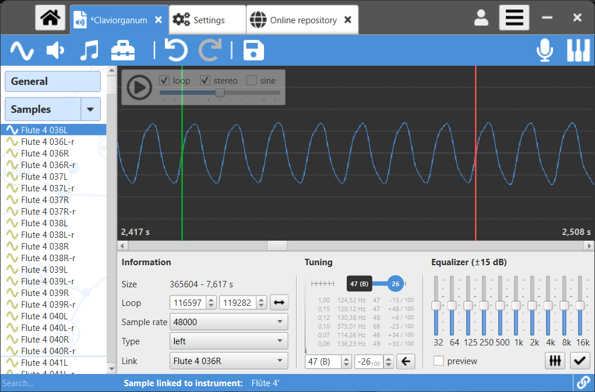

# Polyphone

Polyphone is an open-source soundfont editor for creating musical instruments, available for Windows, Mac OS X and Linux.

###Features

 * editing of sf2, sf3, sfz and sfArk file formats
 * compatible with jack and asio audio servers
 * built-in synthesizer, controlled by a virtual keyboard or midi signals
 * automatic recognition of root keys
 * automatic loop of samples
 * simultaneous editing of parameters
 * specific tools for musical instrument creation
 * recorder to keep a trace of what is played in a .wav file

### Screenshots

 
 

### Install

Check this [page](http://polyphone-soundfonts.com/en/download) to find installers for your system.

### Support

See the [documentation](http://polyphone-soundfonts.com/en/documentation) and [forum](http://polyphone-soundfonts.com/en/forum).

- - - - 

