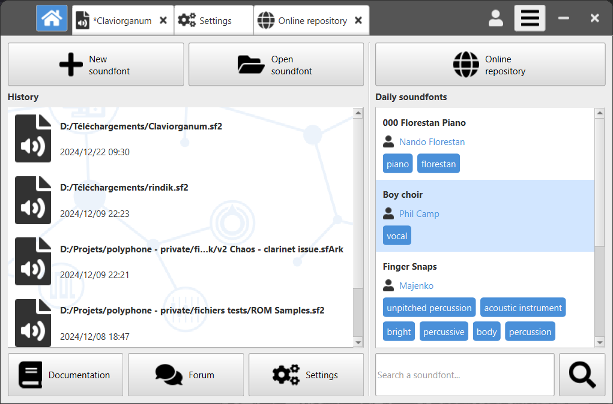

# Polyphone

Polyphone is a multiplatform and open-source soundfont editor for creating musical instruments.

### Features

 * editing of sf2, sf3, sfz and sfArk file formats
 * compatible with Jack and ASIO audio servers
 * built-in synthesizer, controlled by a virtual keyboard or MIDI signals
 * automatic recognition of root keys
 * automatic loop of samples
 * simultaneous editing of parameters
 * specific tools for musical instrument creation
 * recorder to keep a trace of what is played in a .wav file
 * soundfont browser connected to the online repository

### Screenshots

  
  
  
  

### Install

Check this [page](https://www.polyphone.io/software) to find installers for your system.

### Support

See the [documentation](https://www.polyphone.io/documentation) and [forum](https://www.polyphone.io/forum).

### Contributing

To contribute to the project (create a bug report / suggest an improvement / complete a translation), please see this [page](CONTRIBUTING.md).

- - - - 

