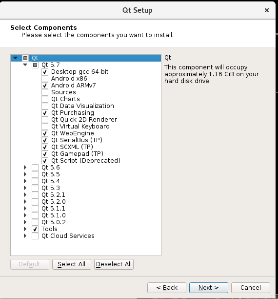

.. _build for fedora:

Building Polyphone for Fedora
=============================

Use these instructions if you cannot install Polyphone on your Fedora distribution with the available installers in the section “Download_” (verified: Aug 7, 2016 on Fedora 24, 64bit).

Prerequisite
------------

Qt installation
^^^^^^^^^^^^^^^

After a base installation of Fedora, install the following packages (including a compiler) as pre-requisites for Qt development::

  sudo dnf update
  sudo dnf groupinstall "C Development Tools and Libraries"
  sudo dnf install gcc-c++
  sudo dnf install mesa-libGL-devel

Then you can either install the default Qt framework with the following command::

  sudo dnf install qt-creator

or install the latest version of the Qt framework and Qt Creator available `here <get qt_>`_.
Download the Qt installer and use these commands to add execution permission and run the installer (you may have to adjust the version number)::

  chmod 755 qt-unified-linux-x64-2.0.3-1-online.run
  ./qt-unified-linux-x64-2.0.3-1-online.run

Just select default components as proposed — unless you want more for other purposes.

   Qt setup in Fedora

If you want to use Qt Creator install the Polyphone dependencies below and continue with this document: :ref:`build with qt creator`.

Polyphone dependencies
^^^^^^^^^^^^^^^^^^^^^^

Install the following dependencies (if you have synaptic installed you could alternatively use it for installation)::

  sudo dnf install qt-devel
  sudo ln -s /usr/bin/qmake-qt4 /usr/bin/qmake
  sudo dnf install zlib-devel
  sudo dnf install alsa-lib-devel
  sudo dnf install jack-audio-connection-kit-devel
  sudo dnf install portaudio-devel
  sudo dnf install libogg-devel
  sudo dnf install libvorbis-devel

Build
-----

Sources
^^^^^^^

First, get Polyphone sources from `here <download_>`_ or from `Github <on github_>`_.

polyphone.pro modifications
^^^^^^^^^^^^^^^^^^^^^^^^^^^

Modify the file :file:`polyphone.pro` to use distributed versions for rtmidi, stk and qcustomplot.
Uncomment the following lines by removing the leading ‘#’::

  DEFINES += USE_LOCAL_RTMIDI
  DEFINES += USE_LOCAL_STK
  DEFINES += USE_LOCAL_QCUSTOMPLOT

.. note::
   instead of these modifications you could try to build Polyphone with the Fedora / RPM distributions for these packages.
   The installation commands would be:

   ::

     sudo dnf install rtmidi-devel
     sudo dnf install stk-devel
     sudo dnf install qcustomplot-devel

However, running :command:`qmake` afterwards, it claimed to not recognize rtmidi on the system.
As on Windows and Mac Systems the use of the local distributed rtmidi, stk and qcustomplot versions are forced you may not saw any benefit in sorting out the issue with the rtmidi.

Getting the executable
^^^^^^^^^^^^^^^^^^^^^^

Go into source directory (where the file :file:`polyphone.pro` is located), open a terminal and build Polyphone with this command::

  qmake && make

If everything goes well you will have the compiled polyphone in the :file:`RELEASE` subdirectory.

Troubleshooting
---------------

See this topic_ if you need more information or for getting some help.

.. note::
   Special thanks to tomotello_ for this article.

.. external links:

.. _get qt:    https://www.qt.io/download-open-source/
.. _download:  https://www.polyphone-soundfonts.com/en/download
.. _on github: https://github.com/davy7125/polyphone
.. _topic:     https://www.polyphone-soundfonts.com/en/forum/support-bug-reports/9-success-polyphone-fedora-rpm-linux-build
.. _tomotello: https://www.polyphone-soundfonts.com/en/profile/820-tomotello
