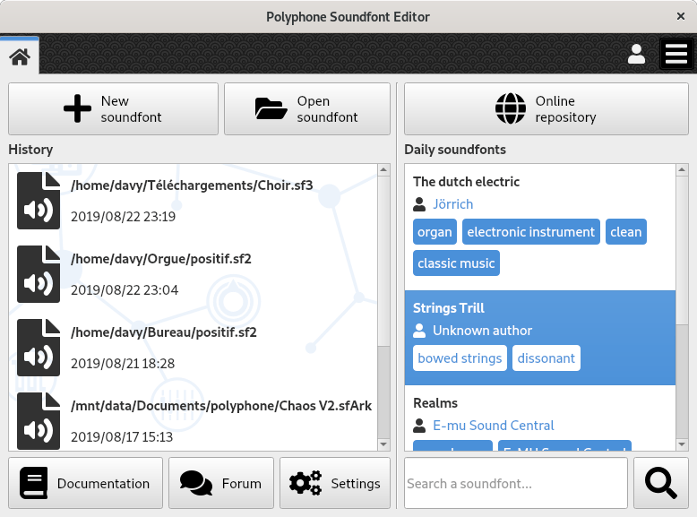

.. index:: home screen
.. _home screen:

Home screen
===========

The first screen of Polyphone is basically made of 3 parts:

* a `left part`_, containing a file history and shortcuts;
* a `right part`_, dedicated to the soundfont repository;
* a `top area`_, containing tabs and a menu.

   Home screen of Polyphone

.. _left part:

Left part
---------

.. index:: open

Opening a soundfont
^^^^^^^^^^^^^^^^^^^

Three ways for opening a soundfont:

* a click on :guilabel:`Open soundfont` opens a file browser, the allowed file to select having the extension sf2, sf3, sfArk or sfz (the different formats are described :ref:`here <sf formats>`);
* a click on :guilabel:`Create a soundfont` opens an empty soundfont, everything is to be done from scratch;
* a double-click on a soundfont from the history re-open it.

When a soundfont is open, a new tab appears with a :ref:`soundfont editor <sf editor>` inside.

Shortcuts
^^^^^^^^^

Three buttons are located at the bottom of the left part:

* :guilabel:`Documentation`: open a web browser for reading the Polyphone documentation_.
* :guilabel:`Forum`: open a web browser with the URL of the Polyphone forum_.
* :guilabel:`Settings`: open the :ref:`settings <settings>` of the software in a new tab.

.. _right part:

Right part
----------

Online repository
^^^^^^^^^^^^^^^^^

A click on the button :guilabel:`Online repository` opens a tab with the :ref:`soundfont browser <sf browser>`.

Daily soundfonts
^^^^^^^^^^^^^^^^

Every day, 5 random soundfonts are displayed here.
This is made for inciting people discovering new soundfonts.
Double-clicking on one of them opens a new tab with the corresponding :ref:`soundfont description <sf description>`.

Search
^^^^^^

It is possible to write a keyword here for searching specific soundfonts and the results will be displayed in the :ref:`soundfont browser <sf browser>`.

.. _top area:

Top area
--------

Tabs
^^^^

The tabs provide a quick access between:

* the `home screen`_ (first tab — always open),
* the :ref:`editor <sf editor>` of an open soundfont,
* the software :ref:`settings <settings>`,
* the :ref:`soundfont browser <sf browser>`,
* a :ref:`soundfont description <sf description>` from the repository.

Menu
^^^^

The menu, located in the top right corner, contains general functions and is described :ref:`here <menu>`.

.. external links:

.. _documentation: https://www.polyphone-soundfonts.com/documentation/
.. _forum:         https://www.polyphone-soundfonts.com/forum/
