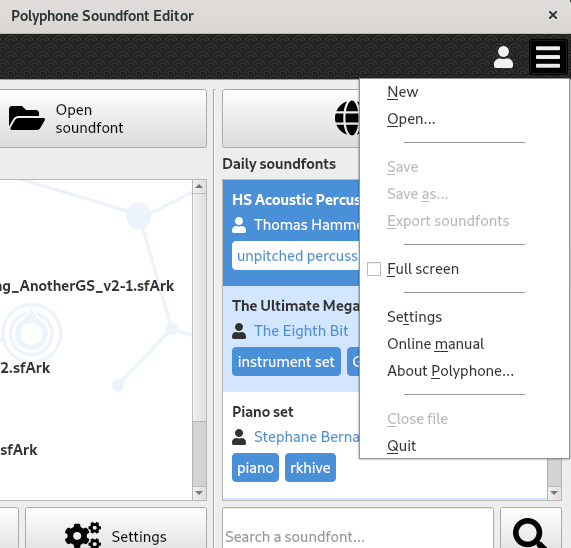
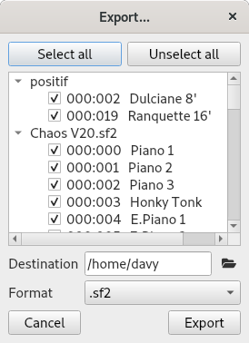

.. _menu:

Menu
====

The menu, located at the top right corner of the software, contains several items allowing you to access different features.

   Menu

.. _menu open:

Opening a soundfont editor
--------------------------

:New: Create a new .sf2 file from scratch.
  Also accessible with the shortcut :kbd:`Ctrl+N`.
:Open: Open an :ref:`.sf2 <sf2 format>`, :ref:`.sf3 <sf3 format>`, :ref:`.sfz <sfz format>` or :ref:`.sfArk <sfark format>` file.
  Also accessible with the shortcut :kbd:`Ctrl+O`.

.. _menu save:

Saving a soundfont
------------------

:Save: Save the current file.
  Also accessible with the shortcut :kbd:`Ctrl+S`.
:Save as: Save the current file in another file.
  Also accessible with the shortcut :kbd:`Ctrl+Shift+S`.
:Export: Export and merge one or several presets from the open soundfonts in the :ref:`.sf2 <sf2 format>`, :ref:`.sf3 <sf3 format>` or :ref:`.sfz <sfz format>` format.
  Also accessible with the shortcut :kbd:`Ctrl+E`.

   Export window

.. _menu view:

View options
------------

:Full screen: Toggle the full screen mode.
  Also accessible with the shortcut :kbd:`F11`.

.. _menu shortcuts:

Shortcuts
---------

:Settings: Open the software :ref:`settings <settings>`.
:Online manual: Show this user manual in a web browser.
  Also accessible with the shortcut :kbd:`F1`.
:About Polyphone…: Show the software version and the list of people who contributed to the project.

.. _menu close:

Closing
-------

:Close file: Close the current file.
  Also accessible with the shortcut :kbd:`Ctrl+W`.
:Quit: Quit the software.
  Also accessible with the shortcut :kbd:`Ctrl+Q`.
