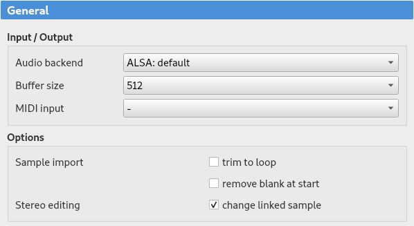
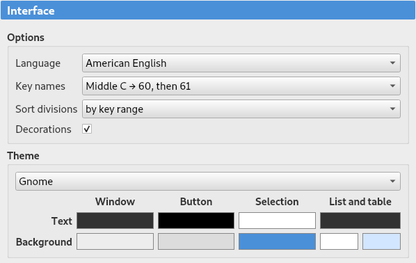
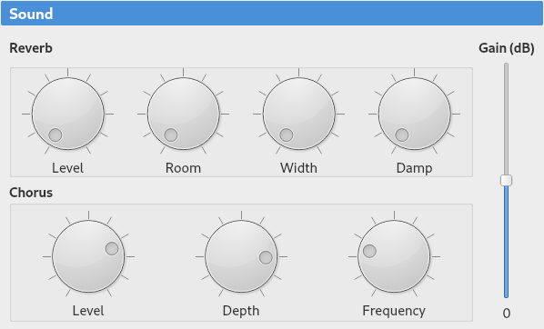
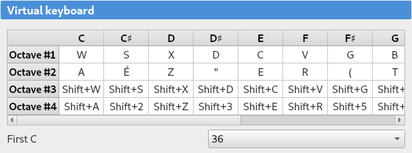
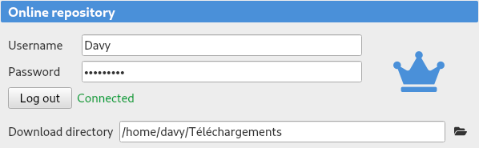

.. _settings:

Settings
========

The software preferences are accessible either from the :ref:`home screen <home screen>` or from the :ref:`menu <menu shortcuts>`.
They are divided into five sections:

* :ref:`general settings`
* :ref:`interface settings`
* :ref:`sound settings`
* :ref:`keyboard settings`
* :ref:`repository settings`

.. _general settings:

General
-------

The :guilabel:`General` section allows the modification of the following parameters:

:Audio back-end: Specifies the audio back-end used to play samples.
  :abbr:`JACK (JACK Audio Connection Kit)` and :abbr:`ASIO (Audio Stream Input/Output)` drivers (the latter for Windows only) may be chosen.
:Buffer size: Specifies the buffer size used for :abbr:`JACK (JACK Audio Connection Kit)` and :abbr:`ASIO (Audio Stream Input/Output)` drivers.
  A small buffer results in a small latency, but the sound may become scratchy.
:MIDI input: Specifies the :abbr:`MIDI (Musical Instrument Digital Interface)` input controlling the virtual keyboard.

Moreover, it is possible to check the following options:

:Sample import\: trim to loop: When importing a sample, data located after the end of loop are automatically removed (same effect as the tool “:ref:`sample tool trimloop`”).
:Wav file import\: remove blank at start: When importing a sample, any blank area located before the beginning of the attack is automatically removed (same effect as the tool “:ref:`sample tool removeblank`”).
:Stereo editing\: change linked sample: When editing one side of a stereo sample, the other side is automatically edited the same.
  The same applies when editing a stereo instrument division: the division corresponding to the other channel (with the same note and velocity ranges) is edited the same.

   Settings, general

.. _interface settings:

Interface
---------

This section shows options related to the interface of the software:

:Language: The language may be changed here (a restart of the software is required).
:Key names: Keys may be named depending on their number (according to :abbr:`MIDI (Musical Instrument Digital Interface)` specification), or depending on the name of middle C (C3, C4 or C5).
  Key names may comprise sharps or flats.
:Sort divisions: The division order within an instrument or a preset can be changed here.
:Decorations: Background decorations in some lists can be deactivated for readability.
:Color theme: Different predefined color themes are available for customizing the appearance of Polyphone.
  A manual selection of colors is also possible.

   Settings, interface

.. _sound settings:

Sound
-----

The :guilabel:`Sound` section makes it possible to modify the chorus and reverb of the synth, along with its global volume.
The global volume may be changed with the volume :abbr:`MIDI (Musical Instrument Digital Interface)` controller if an external keyboard is connected.

   Settings, sound

.. _keyboard settings:

Virtual keyboard
----------------

The keys of the computer keyboard used to control the :ref:`virtual keyboard <toolbar keyboard>` are defined in the :guilabel:`Keyboard` section.
The pitch may be increased or decreased octave by octave.

   Settings, keyboard

.. _repository settings:

Online repository
-----------------

Identifiers can be entered here to link Polyphone with an account, a Premium account unlocking the :ref:`soundfont browser <sf browser>`.

The download directory used by the :ref:`soundfont browser <sf browser>` can be changed here.

   Settings, repository
