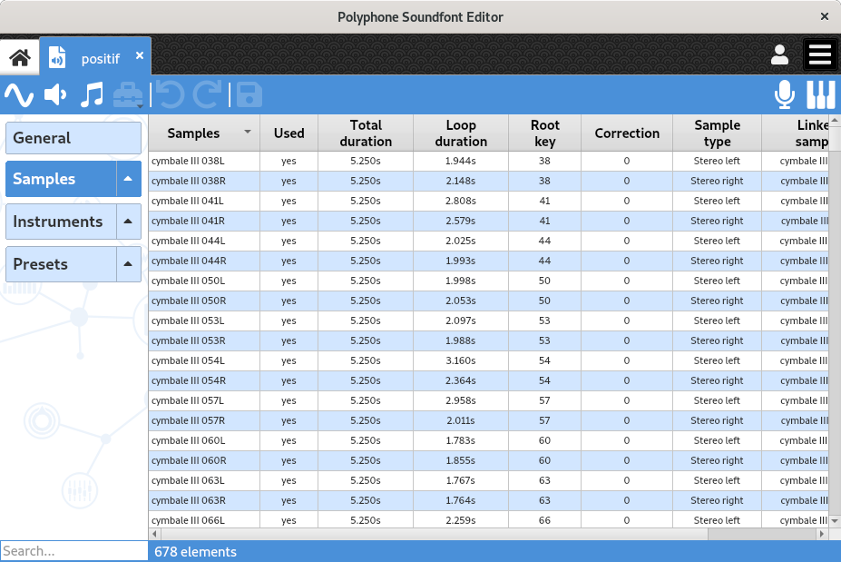
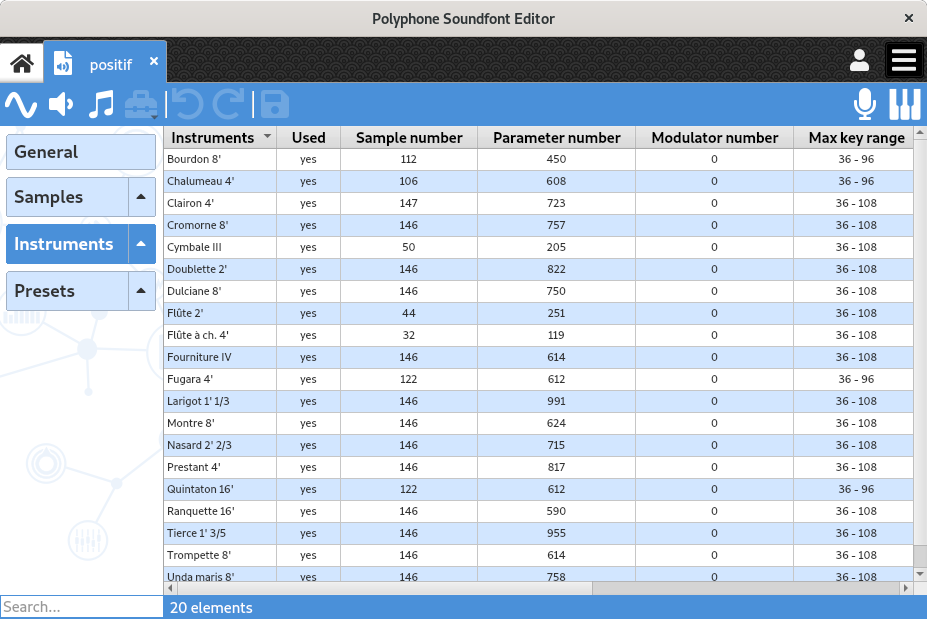
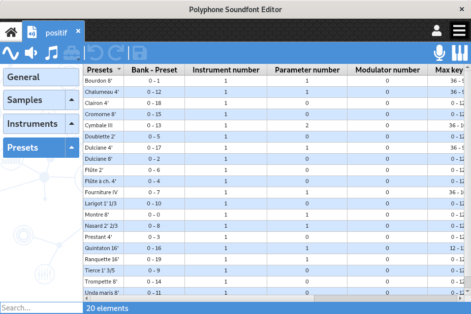

.. _conf summaries:

Configuration summaries
=======================

The configuration summaries provide an overview of all elements contained in a soundfont.
They are accessible via the headers :guilabel:`Samples`, :guilabel:`Instruments` and :guilabel:`Presets` in the :ref:`tree <tree>`, and allow the visualization of their corresponding elements.

Information gathered in these pages can be used to support inspections within large soundfonts.

.. _conf summ sample:

Samples
-------

When clicking on the :guilabel:`Samples` header of a soundfont in the :ref:`tree <tree>`, the sample configuration summary appears.

   Sample configuration summary

For each sample, this page allows for example to perform the following checks:

* Is it used?
* Is its total duration (and possibly its loop duration) long enough?
* Has the tuning been done?
* Is it properly linked in stereo?
* Is the sampling rate high enough for a good audio quality?

.. _conf summ instrument:

Instruments
-----------

When clicking on the :guilabel:`Instruments` header of a soundfont in the :ref:`tree <tree>`, the instrument configuration summary appears.

   Instrument configuration summary

For each instrument, this page allows for example to perform the following checks:

* Is it used?
* Are the numbers of linked samples, parameters and modulators consistent?
* Are the key and velocity ranges correct?
* Have the samples been properly attenuated?
* Is the loop playback on?
* Have the chorus and reverb settings not been forgotten?

.. _conf summ preset:

Presets
-------

When clicking on the :guilabel:`Presets` header of a soundfont in the :ref:`tree <tree>`, the preset configuration summary appears.

   Preset configuration summary

For each preset, this page allows for example to perform the following checks:

* Have the bank and preset numbers been properly filled?
* Are the numbers of linked instruments, parameters and modulators consistent?
* Are the key and velocity ranges correct?
* Have the instruments been accurately attenuated?
* Have the chorus and reverb settings (as offset) not been forgotten?
