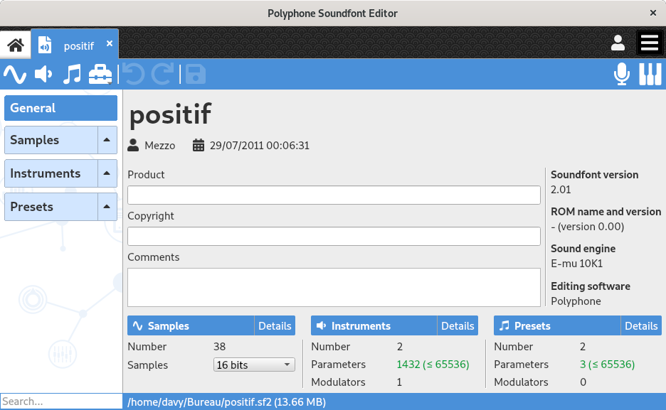

.. _edit general:

Editing of the general information
==================================

The page for editing the general information is displayed when the header :guilabel:`General` is selected in the :ref:`tree <tree>`.
This page is made of three kinds of elements:

* `editable fields     <edit general fields_>`_,
* `general information <edit general info_>`_ that are not editable,
* `statistics          <edit general stats_>`_ about the soundfont.

   Global information page

.. _edit general fields:

Editable fields
---------------

The editing page of the general information provides fields for changing the following attributes:

:Title: This is the internal name of the soundfont, which does not necessarily have to do with the file name.
:Author: Relates to the author name of the soundfont.
:Date: Creation date of the file.
:Product: Product for which is designed the soundfont.
:Copyright: Mention to fill if the file is subject to copyright.
:Comments: Information not included in any of the preceding categories.
:Kind of samples: Indicates whether the samples should be recorded in 16 bits or 24 bits.
  Please note that 24-bit samples may not be supported in some synthesizers.

.. _edit general info:

General information
-------------------

The editing page of the general information comprises the following non-editable information:

:Soundfont version: Corresponds the version of the :ref:`sf2 format <sf2 format>` used by the file.
:ROM name and version: Name and version of a sample ROM if used.
:Sound engine: Corresponds to the name of a sound engine.
:Editing software: Editing software used for the soundfont creation.
:File name: Address and name of the file.
:File size: Size of the soundfont after it is saved.

.. _edit general stats:

Statistics
----------

A count is made on:

* the number of :ref:`samples <sample editor>` and unused samples,
* the number of :ref:`instruments <instrument editor>` and unused instruments,
* the number of :ref:`presets <preset editor>`,
* the number of parameters and modulators edited for the instruments,
* the number of parameters and modulators edited for the presets.

Unused samples and instruments can be easily removed with the tool “:ref:`global tool unused`”.

.. note::
   The number of 65536 parameters in the instruments and the presets should not be exceeded.
   Some synthesizers may not be adapted to read them all.
