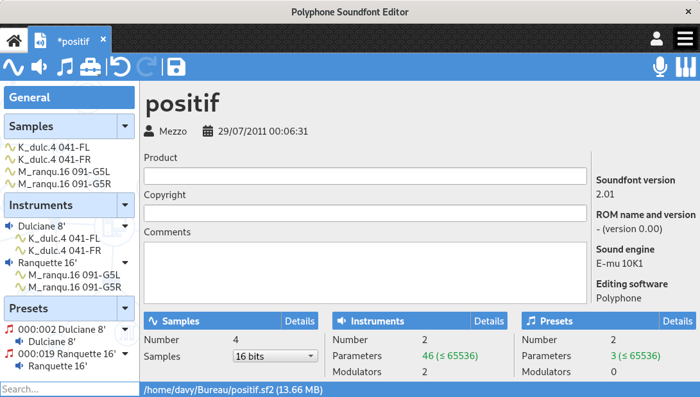

When a soundfont is opened, the [tree](manual/soundfont-editor/tree.md) is filled with the content of the soundfont.
The editors will appear to the right of the tree when elements are selected:

* selecting the header :guilabel:`General` will show the editor of the [general information](manual/soundfont-editor/editing-pages/editing-of-the-general-information.md),
* selecting one or more **samples** will show the [sample editor](manual/soundfont-editor/editing-pages/sample-editor.md),
* selecting **instruments** or **instrument divisions** will show the [instrument editor](manual/soundfont-editor/editing-pages/instrument-editor.md),
* selecting **presets** or **preset divisions** will show the [preset editor](manual/soundfont-editor/editing-pages/preset-editor.md).

