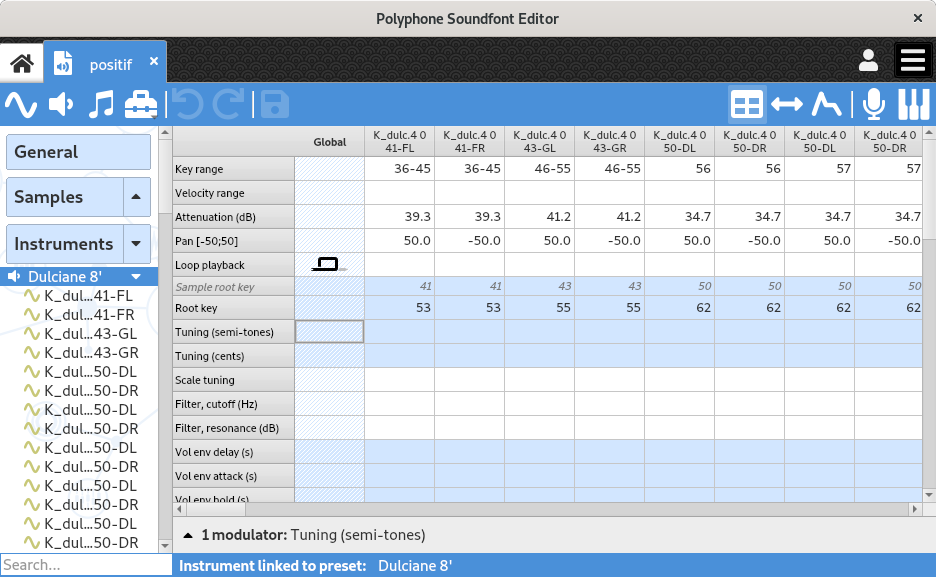
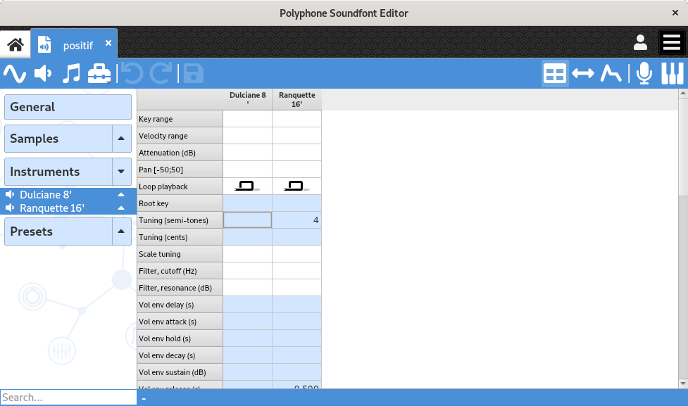
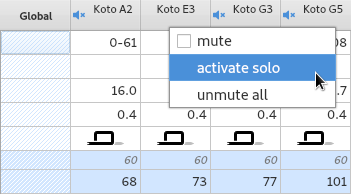
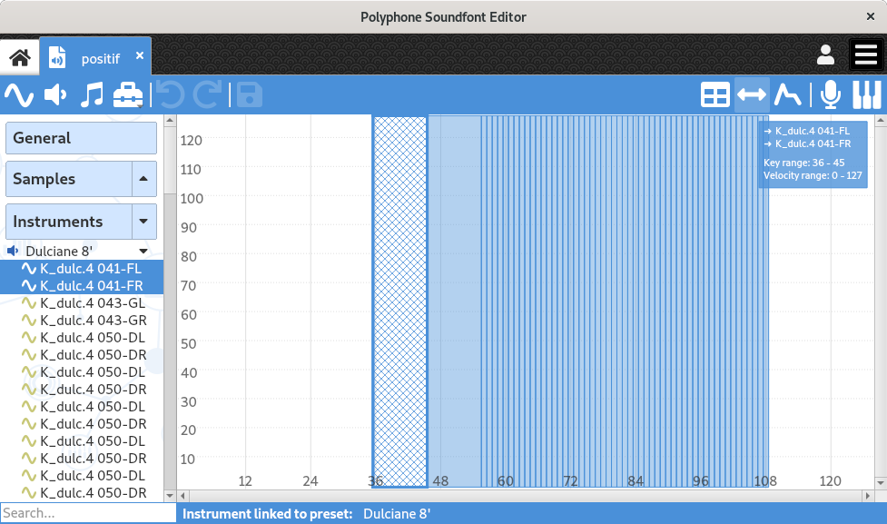
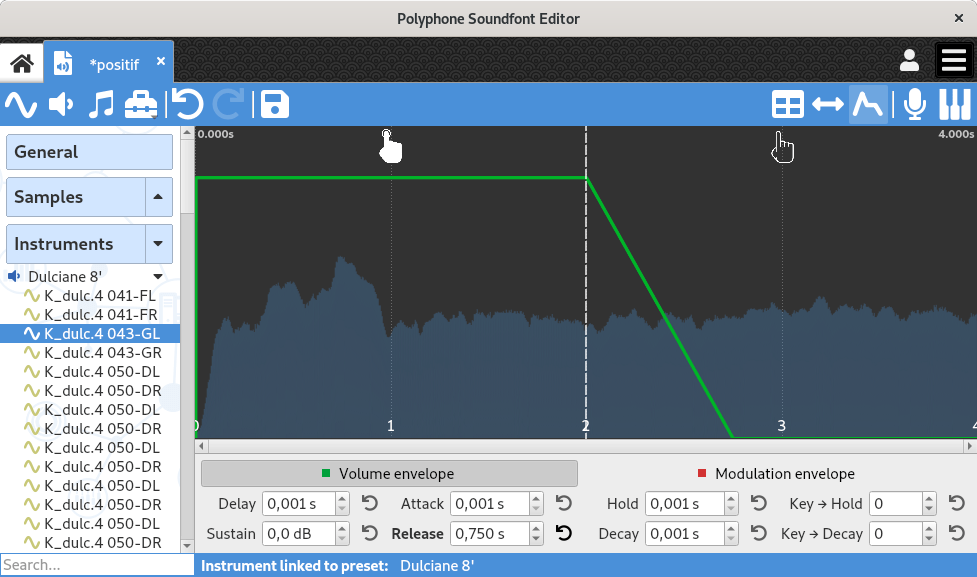
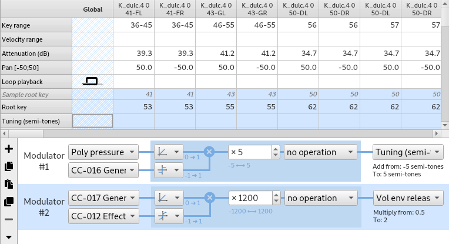

.. _instrument editor:

Instrument editor
=================

When clicking on one or more instrument(s) in the :ref:`tree <tree>`, the editing page of instruments appears.

This page comprises several parts:

* the `table             <instrument editor table_>`_,
* the `range editor      <instrument editor range_>`_ when the button :guilabel:`Edit ranges` from the :ref:`toolbar <toolbar view>` is clicked,
* the `envelope editor   <instrument editor envelope_>`_ when the button :guilabel:`Edit envelope` from the :ref:`toolbar <toolbar view>` is clicked,
* the `modulator section <instrument editor modulator_>`_.

   Instrument page

If only one instrument is selected, the page allows the editing of the global parameters of the instrument and the parameters of all its divisions.

In the case where several instruments are selected, the global parameters of each of these instruments can be edited.

   Instrument page with multiple instruments selected

.. _instrument editor table:

Table
-----

Presentation
^^^^^^^^^^^^

The table allows a global view and the editing of an instrument configuration.
A change of a parameter in the “global” division applies to all divisions, except for divisions whose same parameter is already specified.

The editable parameters are:

:Key range: Key range for which the sound will be heard.
:Velocity range: Velocity range for which the sound will be heard.
  It is possible to set different sounds for the same note, with different velocity ranges (to distinguish different nuances of a piano key for example).
:Attenuation: Attenuation in decibel applied to the sample.

  .. note::
     The sf2 format doesn't allow this value to be negative, no amplification is thus possible.

:Pan: Balance applied to the sound, to hear it to the left or to the right in stereo.
:Loop playback:
  |loop off| indicates a sound reproduced with no loop,

  |loop on| indicates a sound which loops continuously,

  |loop on with end| indicates a sound which loops for the duration of key depression and then proceeds to play the remainder of the sample.

  .. note::
     The sf2 format had no plans for a special playback mode which triggers a sample when a key is released.
     One way to achieve this behavior is to double each sample with a sample containing a short silent loop followed by the sound to emit on the release.
     The added sample will be read with the playback parameter “loop on with end”.

:Root key: Allows you to change the normal root key of a sample to a different note from that usually used.
:Tuning: Change the tuning in semitones and cents of semitones.
  Changing “scale” plays on the difference between two consecutive notes.
:Filter: Apply a low-pass filter, by specifying the cutoff frequency and the resonance.
:Volume envelope: Change the volume envelope, and possibly how it changes with the note.
:Modulation: Set a modulation (envelope, delay, frequency, changes with the note) and its effect on the tone, filter and volume.
:Vibrato: Set a vibrato (time, frequency) and its effect on the tone.
:Exclusive class: This parameter can define one or more exclusive classes, by assigning a set of sounds within a class the same parameter value other than 0.
  When an exclusive class is defined, any note triggered from one of the sounds of the exclusive class ends all the other sounds of the same class.
  The scope of an exclusive class is the preset in which the class is defined (a sound triggered in an instrument will end a sound of another instrument if the two instruments are in the same preset).
  This effect can be used for percussion instruments like a cymbal.
  Basically playing one note automatically terminates another in the same group.
:Chorus and reverb: Indicates the intensity of chorus and reverb effects.
  The effects are configurable in the software :ref:`settings <sound settings>`.
:Fixed key and velocity: Can freeze the key and velocity on the key range specified by the linked sample.
:Offsets: Changes the positions of the start and end of a sound during playback, as well as the start and end of the loop.
  The unit of an offset is samples (number of values).

Editing facilities in the table
^^^^^^^^^^^^^^^^^^^^^^^^^^^^^^^

To facilitate and speed up editing in the table, the following features have been implemented:

* the mouse wheel may be used to change a value (the cell has to be in edit mode first),
* a keyboard can be used to set the rootkey, key range and velocity range (the cell has to be in edit mode first),
* a multiple selection, followed by the editing of the last cell, will edit all cells simultaneously,
* the keys :kbd:`Del` and :kbd:`Backspace` clear the content of all selected cells,
* stereo divisions may be edited simultaneously if the option is enables in the software :ref:`preferences <general settings>`,
* key names may be numeric or as a text (having C3, C4 or C5 as middle C), depending on the option chosen in the :ref:`preferences <interface settings>`,
* copy / paste / cut of a set of cells (not necessarily adjacent) may be done via :kbd:`Ctrl`\ +\ :kbd:`C` / :kbd:`Ctrl`\ +\ :kbd:`V` / :kbd:`Ctrl`\ +\ :kbd:`X`.

Do not forget the :ref:`tools <instrument tools>` available!
In particular the tool allowing a :ref:`key-based configuration <instrument tool global>`.

Possibility to mute divisions
^^^^^^^^^^^^^^^^^^^^^^^^^^^^^

For testing purposes, it is possible to mute a division or mute all divisions but one in the tables.
The options are accessible with a right click on the header of a division.

   Mute divisions in a table

.. _instrument editor range:

Key range editor
----------------

The key range editor allows you to quickly and graphically dispose samples according to their key and velocity ranges.
This graph further highlights configuration problems, such as zones free of samples or unwanted superpositions.

   Key range editor

Each sample is represented by a rectangle.
The color is semitransparent, so that the superposition of several elements is identifiable.

Rectangle selection
^^^^^^^^^^^^^^^^^^^

A simple left click on a rectangle will select it and removes all other selections.
If several rectangles are superimposed, consecutive clicks change the selection under the mouse cursor.

A multiple selection is possible:

* by maintaining button :kbd:`Ctrl` and then clicking on the different rectangles to select one by one,
* by using button :kbd:`Shift`: all rectangles between the first rectangle being clicked and the next one will be selected.

Updating the rectangles
^^^^^^^^^^^^^^^^^^^^^^^

After having selected one or more rectangle(s), it is possible with the left button to:

* change the size, when you grab one of the edges of a rectangle;
* change the position, by pointing to the center of a rectangle.

If several rectangles are selected, all changes are made synchronously.

Drag & zoom
^^^^^^^^^^^

Maintaining the right click allows you to change the zoom around the selected point.

Maintaining the left click allows you to move the graphic if the initial point is not on a rectangle.

.. _instrument editor envelope:

Envelope editor
---------------

The envelope editor provides a graphical overview of the 8 parameters defining the volume envelope and the 8 parameters defining the modulation envelope.
This is thus a tool for better understanding the impact of each of these parameters.

   Envelope editor

The buttons above the graph select alternatively the volume envelope (displayed in green) or the modulation envelope (displayed in red) for the editing.
During the editing of the modulation envelope, the volume envelope is displayed with a thin line.

The left part of the graph represents the evolution of the envelope when a key is **triggered**.
7 of the 8 parameters are involved in this representation:

:Delay: duration during which the envelope remains at 0 just after a key is triggered,
:Attack: duration after **delay** during which the envelope grows from 0 to the maximum value,
:Hold: duration after **attack** during which the envelope keeps its maximum value,
:Decay: duration after **hold** during which the envelope progressively goes from the maximum value to the value specified by **sustain**,
:Sustain: value after **decay** sustained as long as the triggered key is not released,
:Key → Hold: change of the **hold** duration depending on the key (see below),
:Key → Decay: change of the **decay** duration depending on the key (see below).

A positive value in **Key → XXX** gradually decreases the duration of XXX toward the trebles, whereas a negative value does the opposite.
For instance:

* value 100 halve the duration of XXX per octave above middle C (60) and double the duration of XXX per octave below middle C,
* value -100 double the duration of XXX per octave above middle C (60) and halve the duration of XXX per octave above middle C.

The right part represents the evolution of the envelope when a key is **released**.
Only the **release** duration is involved in this representation.
The envelope gradually returns to 0 during this duration.

When only one division of an instrument is selected in the tree, the corresponding sound :ref:`sample <sample editor>` is displayed on the background.
It is thus possible to better visualize the evolution of the envelope relative to the sample being played.

.. _instrument editor modulator:

Modulators
----------

The lower section of the editing page of instruments is intended for the creation of modulators, globally for an instrument or for a particular division.
When you play an instrument, a modulator listens to one or two MIDI signal(s) and modify one of the parameters in the table according to the mathematical rule configured.
The output of a modulator can also be used as input to another modulator (this function appeared in version 2.04 of :ref:`sf2 format <sf2 format>` and may not be supported by some synthesizers).

   Modulator editor

Buttons on the left are made for:

* expanding / collapsing the modulator area,
* adding / removing a modulator,
* copying / pasting / duplicating one or more modulators.

When a modulator is added, the border of the corresponding cell in the table is thicker (see the tuning in the global column above).

.. inline images:

