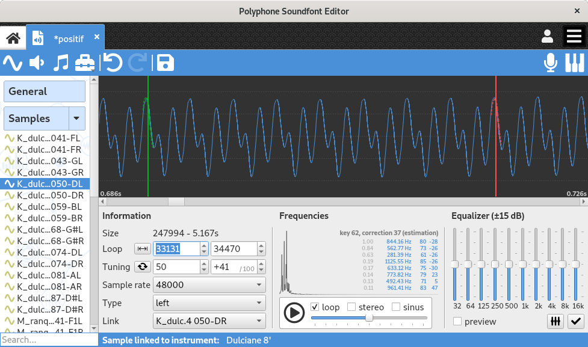
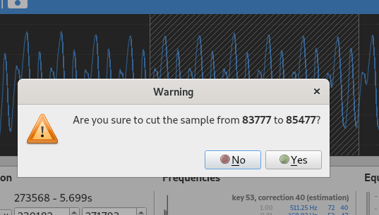
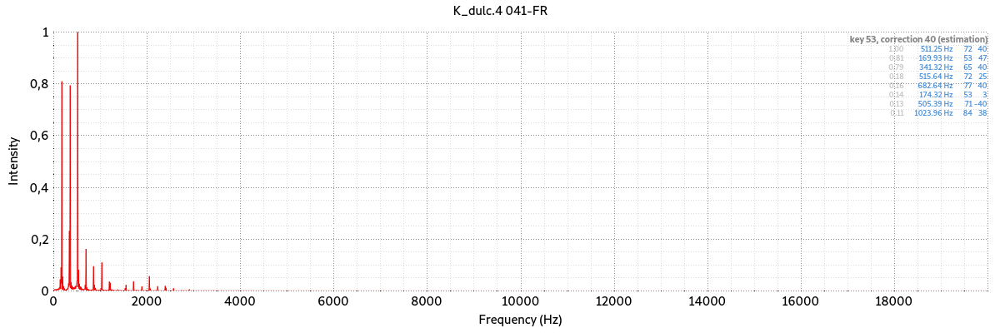

.. _sample editor:

Sample editor
=============

When clicking on one or more sample(s) in the :ref:`tree <tree>`, the editing page of the samples appears.

This page is divided into several parts:

* a `graph                   <sample editor graph_>`_ representing the sample,
* an `information            <sample editor info_>`_ area,
* an analyze of `frequencies <sample editor frequency_>`_,
* an `equalizer              <sample editor equalizer_>`_,
* a sample `player           <sample editor player_>`_.

   Sample page

.. _sample editor graph:

The graph
---------

Zoom & drag
^^^^^^^^^^^

The graph allows the visualization of the sound wave.
It is possible to zoom vertically or horizontally by holding a right mouse click and dragging:

* dragging right expands the horizontal axis,
* dragging left contracts the horizontal axis,
* dragging up expands the vertical axis,
* dragging down contracts the vertical axis.

Holding the left mouse button allows a horizontal move of the graph, if the horizontal axis has been expanded.

Loop and playing positions
^^^^^^^^^^^^^^^^^^^^^^^^^^

A green vertical bar indicates the start position of the loop (changeable by left click), a red bar indicates the position of the end of the loop (changeable by right click).
A dotted line representing a wave portion is associated with each vertical bar, useful for visualizing the superimposition of the beginning and the end of the loop.

During playback, a white vertical bar runs across the graph and indicates the playback position in real time.

Cutting the sample
^^^^^^^^^^^^^^^^^^

When holding the :kbd:`Alt` keyboard button, it is possible to define an area to cut:

* a left mouse button press defines the start of the area,
* the corresponding left mouse button release defines the end of the area.

Once an area is defined, a dialog appears to ask for a confirmation before cutting the sample.

   Cutting sample

Colors of the graph
^^^^^^^^^^^^^^^^^^^

Graph colors are editable in the software :ref:`preferences <interface settings>`.

.. _sample editor info:

The section “Information”
-------------------------

The section “Information” allows the editing of the following information:

* start and end of the loop,
* root key of the sample and its correction to be applied for the sound to be tuned in the equal temperament,
* sound sample rate (a change will cause re-sampling),
* sound type (not linked: mono, otherwise left, right or linked),
* the linked sample if the sample is stereo.

In addition, the sample size in samples (number of values) and seconds is shown.

A button automatically edits the start and end of the loop so that the loop is the entire sample.
Another button automatically edits the root key and the correction so that they match with the evaluation of the `frequency <sample editor frequency_>`_.

Any change on a stereo sample may be applied on the linked sample if the option :guilabel:`Stereo editing` is ticked in the :ref:`preferences <general settings>`.
Via a multiple selection in the :ref:`tree <tree>`, several samples may be edited simultaneously.

.. _sample editor frequency:

Frequency analysis
------------------

The frequency analysis includes a Fourier transform (graph showing the intensity of frequencies contained in the signal).
On the right is shown the list of dominant peaks with the following information:

* ratio between the peak intensity and the intensity of the maximum peak,
* frequency,
* corresponding key,
* correction.

From these data an estimate of the pitch of the sound is made.
This estimate can be used for tuning.

An export of the graph into a png image is possible by using the contextual menu of the graph (right click).
A :ref:`tool <sample tool peakfrequencies>` is also available to export peak information of all samples.

   Fourier graph

.. _sample editor equalizer:

Equalizer
---------

The equalizer makes it possible to increase or decrease some frequencies, from -15 to 15 dB.
It is possible to listen to the effect with the option :guilabel:`preview` enabled and then definitely apply the effect by pressing the :guilabel:`Apply` button.
Pressing :guilabel:`reset` resets all the buttons to 0 dB (but does not remove the effect on the sound: for that use the :guilabel:`undo` button in the :ref:`toolbar <toolbar>`).

Any change on a stereo sample may be automatically applied on the linked sample if the option is checked in the :ref:`preferences <general settings>`.

.. _sample editor player:

Player
------

The player plays the sound.
During playback, a white cursor runs across the graph to indicate the playback position.
Playback options are:

:Loop: Plays the sound loop if the beginning and end of the loop are completed.
:Stereo: Plays the sample in stereo, with its linked sample.
  If looping is required, the two respective loops are used (they can be different).
:Sinus: A sinus calibration is added to the sound, allowing a sample tuning to the nearest pitch hundredth.
  At first the root key must be filled.
  At this level, beats can be heard if the frequency of the sinus differs slightly from the fundamental frequency of the sound.
  It remains to finely adjust the correction to make the beats as slow as possible, so that the sample is tuned at best.
  See the tutorial “:ref:`how to prepare a sample`” for more information.

If a playback is in progress when switching from one sample to another through the :ref:`tree <tree>`, it automatically restarts.
Also, pressing the key :kbd:`space` enables or disables playback if we are navigating in the tree.
