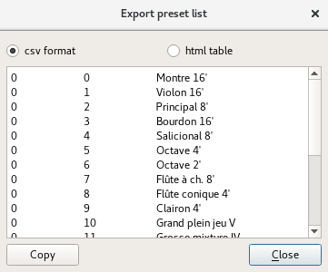

.. _global tools:

Global tools
============

When the header :guilabel:`General` is selected in the :ref:`tree <tree>`, the :ref:`tool menu <tool menu>` provides tools sorted in 3 categories:

* :ref:`global tools clean`
* :ref:`global tools mod`
* :ref:`global tools util`

.. _global tools clean:

Clean up
--------

.. _global tool unused:

Remove unused elements
^^^^^^^^^^^^^^^^^^^^^^

All samples and instruments being used by no instruments or presets are automatically deleted.

.. _global tools mod:

Modulators
----------

.. _global tool remove_mods:

Remove all modulators
^^^^^^^^^^^^^^^^^^^^^

All :ref:`modulators <instrument editor modulator>` present in all :ref:`instruments <instrument editor>` and :ref:`presets <preset editor>` will be removed.

.. _global tools util:

Utility
-------

.. _global tool export:

Export preset list
^^^^^^^^^^^^^^^^^^

With this tool, the list of all :ref:`presets <preset editor>` will be written in a text.
This text can be formatted to be integrated in a CSV file or in HTML to be integrated in a website.

   Preset list
