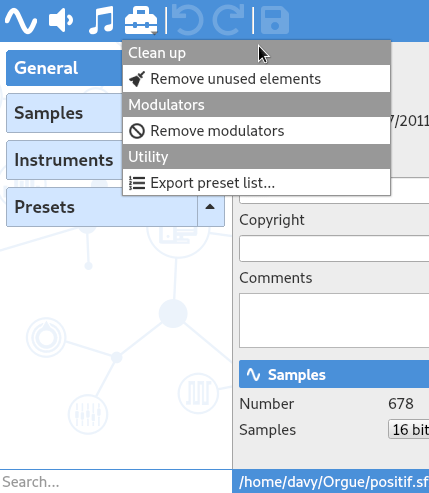
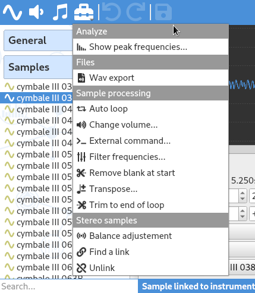
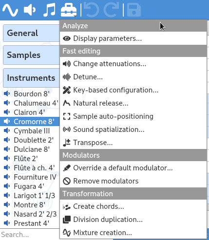
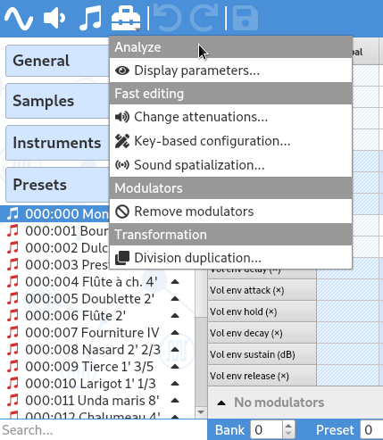

Tools overview
==============

Global tools
------------

When the header :guilabel:`General` is selected in the :ref:`tree <tree>`, the tool menu is filled with :ref:`global tools <global tools>`.

   Tool menu showing global tools

Sample tools
------------

When one or more samples are selected in the :ref:`tree <tree>`, the tool menu is filled with :ref:`sample tools <sample tools>`.

   Tool menu showing sample tools

Instrument tools
----------------

When one or more instruments (including the divisions) are selected in the :ref:`tree <tree>`, the tool menu is filled with :ref:`instrument tools <instrument tools>`.

   Tool menu showing instrument tools

Preset tools
------------

When one or more presets (including the divisions) are selected in the :ref:`tree <tree>`, the tool menu is filled with :ref:`preset tools <preset tools>`.

   Tool menu showing preset tools
