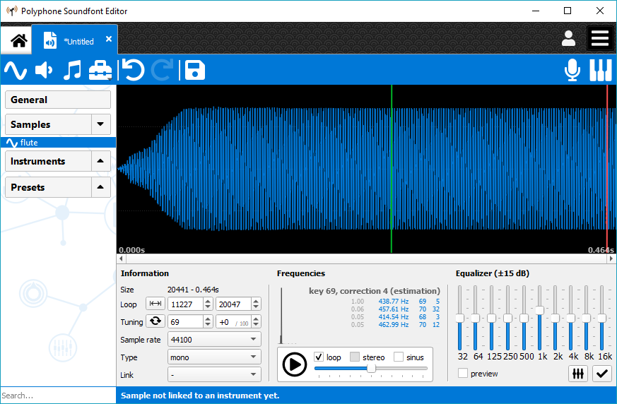
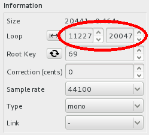
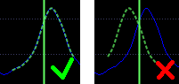
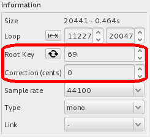
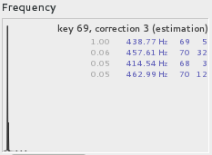
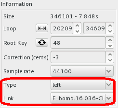

.. _how to prepare a sample:

How to prepare a sample
=======================

An instrument built in a soundfont is made of samples, coming for example from the recordings of a real instrument.
This tutorial describes how to add and prepare a sample in a soundfont.

Import
------

You must first have samples on your computer.
A lot of free samples can be found on internet, being either recorded from real instruments (from a flute, guitar, cello, …) or created with different kinds of audio synthesis.

For this tutorial this flute sample is provided: :download:`flute.wav <https://www.polyphone-soundfonts.com/downloads/tutorials/flute.wav>`.

Once you have it, create a new soundfont with Polyphone (:menuselection:`File --> New`) and import the sample (:menuselection:`File --> Import samples`).

   Import sample

Loop
----

Introduction
^^^^^^^^^^^^

A loop is an area within a sample that can be repeated to extend the duration of the sample.
Let's say a sample lasts only 0.5 second, with a nice loop the sound can be extended up to 10 seconds or more.
This is useful only for samples of non-percussive instruments such as flutes, trumpets, organs, violins.
To the opposite, drums require no loops.
This might also be the case for a piano or a guitar, depending on how these sounds are synthesized.

Thus, this section is necessary if and only if you feel the need of extending the original length of a sample.
If not, go directly to the next section “Tuning”.

Configuring a loop
^^^^^^^^^^^^^^^^^^

In the tree, click on the sample you want to loop and focus on the loop parameters.

   Loop sample: loop parameters

If you are lucky, these values were packaged in the .wav sample and these fields are already filled.
If not, or if it's been badly configured (this can happen…), arbitrarily click left and right on the graphic (WAV display area) to define the beginning and the end of the loop.
This is generally done on the steady phase of the sound, not within the attack or the release.
Then, zoom around the beginning of the loop and try to superimpose the green (or red) and blue curves.

   Loop sample: wave alignment

Listening to the result
^^^^^^^^^^^^^^^^^^^^^^^

When the loop is configured, press :guilabel:`play` on the player with the loop enabled to check the result.

   Loop sample: check the result

If you don't hear the transition once the end of the loop is read, this means that the loop is good.
Otherwise, keep the player on and slightly move the end and / or the beginning of the loop until you find points with a transition as smooth as possible.
Try the next records to see the difference between a bad and a good loop:

* :download:`bad loop <https://www.polyphone-soundfonts.com/downloads/tutorials/bad-loop.mp3>`
* :download:`good loop <https://www.polyphone-soundfonts.com/downloads/tutorials/good-loop.mp3>`

.. note::
   A tool exists to “cheat” if you cannot find a loop easily: the :ref:`auto-loop <sample tool autoloop>` tool.
   It will automatically create a loop by cutting the sample and superimposing two sections, so that the end of the section will exactly match its beginning.
   See the related documentation for more information.

Tuning
------

All samples have to be tuned if you don't want an out-of-tune instrument.
By indicating in the soundfont the exact pitch of all imported samples, the soundfont will be able to adapt them to keys.
Some samples may already have these information, in which case you shouldn't have to change the values in :guilabel:`Root Key` and :guilabel:`Correction (cents)`.
But as a precaution it is always good to check.

   Tune sample: pitch information

Enable the loop if the sample has one and press :guilabel:`play` on the player.
Then add the calibration sinus and adjust its volume so that you can hear both sounds as clearly as possible.

   Tune sample: play sample along with calibration signal

Start the tuning by changing the root key until the two sounds most closely match.
Continue by adjusting the correction.
For this step, pay attention to any beats that occur and make sure they are as slow as possible.
Here are examples containing the sound of a flute and a calibration sinus:

* :download:`very bad tune <https://www.polyphone-soundfonts.com/downloads/tutorials/very-bad-tune.mp3>` (the root key doesn't match)
* :download:`bad tune <https://www.polyphone-soundfonts.com/downloads/tutorials/bad-tune.mp3>` (the correction is not correct and you can hear beats)
* :download:`good tune <https://www.polyphone-soundfonts.com/downloads/tutorials/good-tune.mp3>` (both values are good)

.. note::
   The :ref:`frequency <sample editor frequency>` analysis can be a good indicator to start tuning.
   But keep in mind that no algorithm is perfect for this task and only your ears will find the right tune.

   Tune sample: frequency analysis

To go further
-------------

Several tools are available in the menu :guilabel:`Tools`.
You can edit samples by:

* :ref:`removing blank <sample tool removeblank>` at start,
* :ref:`equalizing <sample editor equalizer>` the sound,
* :ref:`transposing <sample tool transpose>`,
* :ref:`normalizing <sample tool volume>` the volume,
* :ref:`adjusting the balance <sample tool balance>` for stereo samples.

Note on the stereo samples
--------------------------

Stereo samples are made of two mono samples.
The link is stored in the information of a sample.

   Stereo sample

Managing two mono samples may add difficulty to loop them because a loop can sound fine for one side and not for the other.
In that case, don't hesitate to cheat by configuring two different loops on the right and left side.
The quality of the sound will not be impaired.
