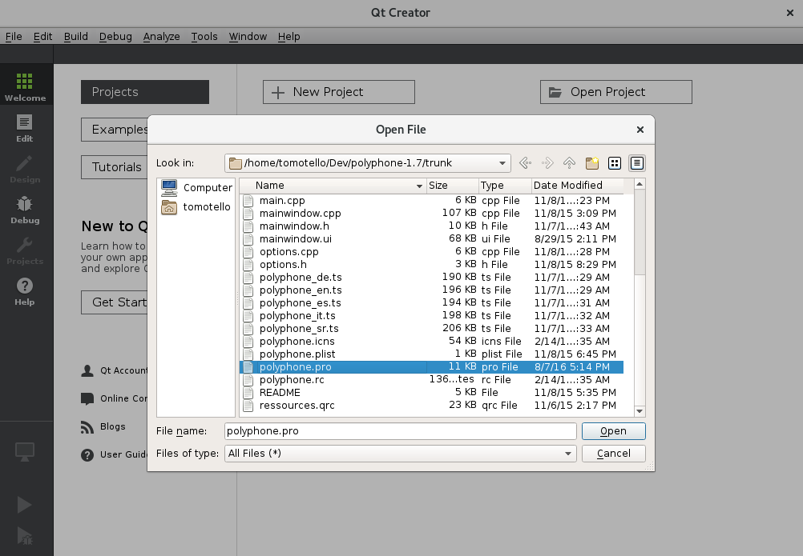
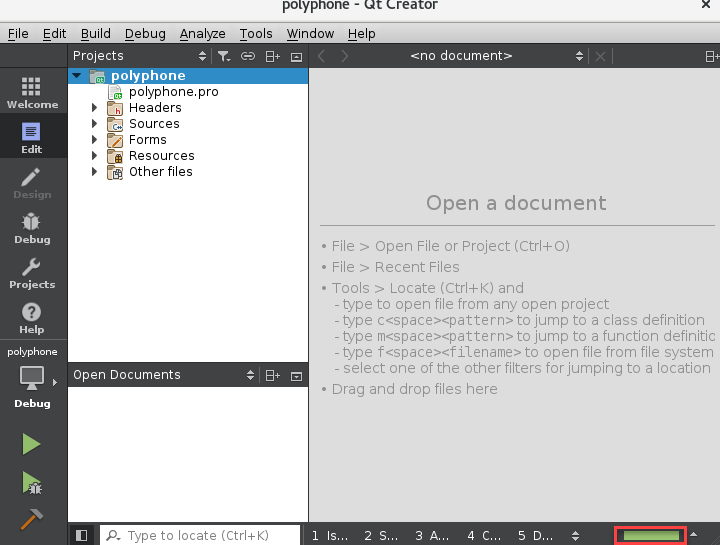

.. _build with qt creator:

Использование Qt Creator для сборки Polyphone
=============================================

Используйте эти указания, чтобы узнать, как собрать Polyphone с помощью Qt Creator.
Предполагается, что на вашем компьютере уже установлен Qt Creator с фреймворком Qt, компилятором и необходимыми зависимостями для сборки Polyphone (см. соответствующие страницы).

Перед тем как начать
--------------------

Требуются следующие элементы:

* компилятор C++ (VC++, Clang, GCC, …)
* Qt Creator с фреймворком
* зависимости Polyphone

Инструкции по их установке зависят от используемой вами ОС, см. соответствующие страницы документации для этого.

Сборка Polyphone
----------------

Скопируйте исходники
^^^^^^^^^^^^^^^^^^^^

Загрузите исходники Polyphone `здесь <download_>`_ или на `GitHub <on github_>`_.

Откройте и настройте проект
^^^^^^^^^^^^^^^^^^^^^^^^^^^

Сначала измените файл :file:`polyphone.pro`, чтобы использовать локальные версии :program:`rtmidi`, :program:`stk` и :program:`qcustomplot`, поставляемые вместе с исходниками Polyphone, если ваша ОС их не предоставляет.
Раскомментируйте следующие строки, удалив начальный символ «#»::

  DEFINES += USE_LOCAL_RTMIDI
  DEFINES += USE_LOCAL_STK
  DEFINES += USE_LOCAL_QCUSTOMPLOT

Вы можете пропустить эти изменения, если хотите использовать библиотеки, уже установленные на вашем компьютере (убедитесь, что они у вас есть!).

Запустите Qt Creator и откройте файл :file:`polyphone.pro`.

   Запуск Qt Creator

Затем настройте проект.

.. figure:: images/configure-project.png

   Настройка проекта

Запустите qmake и соберите проект
^^^^^^^^^^^^^^^^^^^^^^^^^^^^^^^^^

Зайдите в меню :guilabel:`Build` и выберите пункт :guilabel:`Run qmake`.

.. figure:: images/run-qmake.png

   Запуск qmake

Работа :command:`qmake` завершится, когда полоса в правом нижнем углу достигнет 100% зелёного цвета.

   Завершение работы qmake

В разделе :guilabel:`Project` в левом столбце, затем в разделе :guilabel:`Build&Run` выберите конфигурацию сборки (предпочтительнее :guilabel:`Release`).

Наконец, нажмите на действие :guilabel:`Build project Polyphone` в меню :guilabel:`Build`.

.. figure:: images/build-project.png

   Сборка проекта

Во время сборки проекта вы можете увидеть предупреждения, но ошибок быть не должно.

Теперь у вас должен быть исполняемый файл :file:`polyphone` в подпапке :file:`RELEASE` или :file:`DEBUG` исходного кода, в зависимости от того, что вы выбрали в конфигурации сборки QtCreator.

Отладка
-------

Просмотрите эту `тему <topic_>`_, если вам нужна дополнительная информация или помощь.

.. note::
   Отдельное спасибо Tomotello_ за эту статью.

.. внешние ссылки:

.. _download:  https://www.polyphone-soundfonts.com/en/download
.. _on github: https://github.com/davy7125/polyphone
.. _topic:     https://www.polyphone-soundfonts.com/en/forum/polyphone/support-bug-reports
.. _tomotello: https://www.polyphone-soundfonts.com/en/profile/820-tomotello
