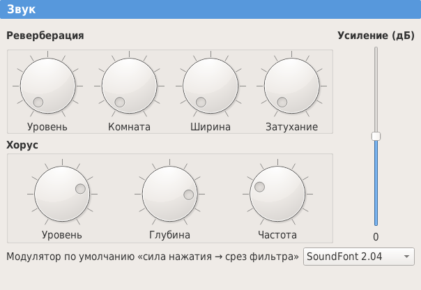

.. _settings:

Настройки
=========

Настройки программы можно открыть либо с :ref:`главного экрана <home screen>`, либо из :ref:`меню <menu shortcuts>`.
Они разделены на пять разделов:

* :ref:`general settings`
* :ref:`interface settings`
* :ref:`sound settings`
* :ref:`keyboard settings`
* :ref:`repository settings`

.. _general settings:

Общие
-----

Раздел :guilabel:`Общие` позволяет изменять следующие параметры:

:Звуковая система: Указывает звуковую систему, используемую для воспроизведения семплов.
  Можно выбрать драйверы :abbr:`JACK (JACK Audio Connection Kit)` и :abbr:`ASIO (Audio Stream Input/Output)` (последний только для Windows).
:Размер буфера: Указывает размер буфера, используемого для драйверов :abbr:`JACK` и :abbr:`ASIO`.
  Маленький буфер даёт маленькую задержку, но звук может стать прерывистым.
:Вход MIDI: Указывает вход :abbr:`MIDI (Musical Instrument Digital Interface)`, управляющий виртуальной клавиатурой.

Кроме того, можно указать следующие параметры:

:Импорт семпла\: обрезать до петли: При импорте семпла информация, расположенная после окончания петли, автоматически удаляется (тот же эффект, что и у средства «:ref:`sample tool trimloop`»).
:Импорт WAV-файла\: убрать тишину в начале: При импорте семпла любая пустая область, расположенная перед началом атаки, автоматически удаляется (тот же эффект, что и у инструмента «:ref:`sample tool removeblank`»).
:Редактирование стерео\: изменить связанный семпл: При редактировании одной стороны стерео-семпла, другая сторона автоматически редактируется таким же образом.
  То же самое относится к редактированию раздела стерео-инструмента: редактируется раздел, соответствующий другому каналу (с той же нотой и диапазонами силы нажатия).

.. figure:: images/settings_general.png

   Настройки, общие

.. _interface settings:

Интерфейс
---------

В этом разделе показаны параметры, связанные с интерфейсом программы:

:Язык: Здесь можно изменить язык (требуется перезапуск программы).
:Названия клавиш: Клавиши могут быть названы в зависимости от их номера (согласно спецификации MIDI) или в зависимости от имени среднего C (C3, C4 или C5).
  Названия клавиш могут включать диезы и бемоли.
:Сортировка разделов: здесь можно изменить порядок разделов внутри инструмента или пресета.
:Украшения: Фоновые украшения в некоторых списках могут быть отключены для удобства чтения.
:Тема: для настройки внешнего вида Polyphone доступны различные предопределённые цветовые темы.
  Также возможна настройка цветов вручную.

.. figure:: images/settings_interface.png

   Настройки, интерфейс

.. _sound settings:

Звук
----

Раздел :guilabel:`Звук` позволяет изменять хорус, реверберацию и общую громкость синтезатора.
Общая громкость также может быть изменена с помощью :abbr:`MIDI (Musical Instrument Digital Interface)`-контроллера громкости, если подключена внешняя клавиатура.

   Настройки, звук

.. _keyboard settings:

Виртуальная клавиатура
----------------------

Клавиши компьютерной клавиатуры, используемые для управления :ref:`виртуальной клавиатурой <toolbar keyboard>`, определены в разделе :guilabel:`Клавиатура`.
Высота тона может быть увеличена или уменьшена на несколько октав.

.. figure:: images/settings_keyboard.png

   Настройки, клавиатура

.. _repository settings:

Онлайн-хранилище
----------------

Здесь можно ввести параметры учётной записи, чтобы связать Polyphone с учётной записью, и если эта учётная запись Премиум, то будет разблокирован :ref:`браузер SoundFont <sf browser>`.

Здесь можно изменить каталог загрузки, используемый :ref:`браузером SoundFont <sf browser>`.

.. figure:: images/settings_repository.png

   Настройки, хранилище
