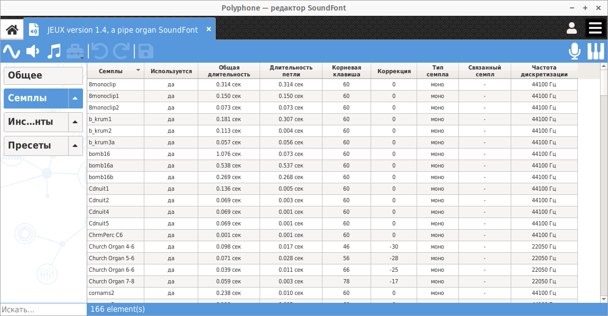
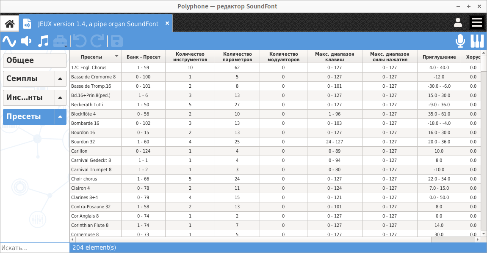

.. _conf summaries:

Сводка конфигурации
===================

Сводка конфигурации предоставляет обзор всех элементов, содержащихся в SoundFont.
Они доступны через заголовки :guilabel:`Семплы`, :guilabel:`Инструменты` и :guilabel:`Пресеты` в :ref:`дереве <tree>` и позволяют визуализировать соответствующие элементы.

Информация, собранная на этих страницах, может использоваться для поддержки проверок в больших SoundFont.

.. _conf summ sample:

Семплы
------

Если щелкнуть заголовок :guilabel:`Семплы` в :ref:`дереве <tree>`, появится сводная информация о конфигурации семпла.

   Сводка конфигурации семпла

Для каждого семпла эта страница позволяет, в том числе, выполнить следующие проверки:

* Используется ли он?
* Достаточно ли велика его общая длительность (и, возможно, длительность петли)?
* Была ли выполнена подстройка?
* Правильно ли связаны стерео-семплы?
* Достаточно ли высока частота дискретизации, чтобы получить хорошее качество звука?

.. _conf summ instrument:

Инструменты
-----------

Если щелкнуть заголовок :guilabel:`Инструменты` в :ref:`дереве <tree>`, появится сводная информация о конфигурации инструмента.

.. figure:: images/conf_summary_instrument.png

   Сводка конфигурации инструмента

Для каждого инструмента эта страница позволяет, в том числе, выполнить следующие проверки:

* Используется ли он?
* Согласованно ли количество связанных семплов, параметров и модуляторов?
* Правильны ли диапазоны клавиш и скоростей нажатия?
* Были ли семплы должным образом приглушены?
* Включено ли воспроизведение петли?
* Не забыты ли настройки хоруса и реверберации?

.. _conf summ preset:

Пресеты
-------

Если щелкнуть заголовок :guilabel:`Пресеты` в :ref:`дереве <tree>`, отобразится сводная информация о конфигурации пресета.

   Сводка конфигурации пресета

Для каждого пресета эта страница позволяет, в том числе, выполнить следующие проверки:

* Правильно ли указаны номера банка и пресета?
* Согласованно ли количество связанных инструментов, параметров и модуляторов?
* Правильный ли диапазон клавиш и скоростей нажатия?
* Были ли инструменты должным образом приглушены?
* Не забыты ли настройки хоруса и реверберации (как смещение)?
