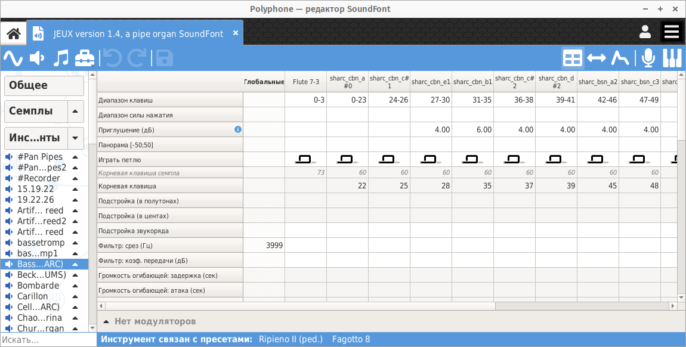
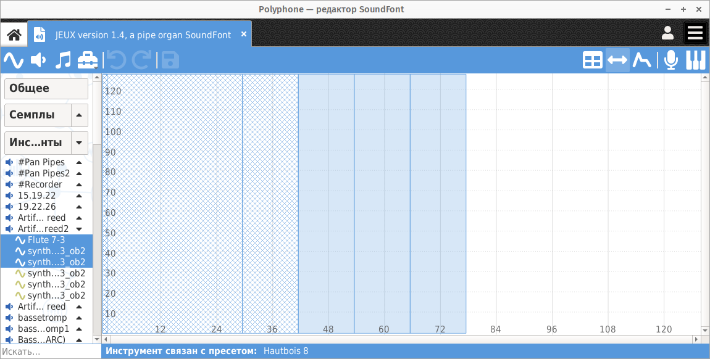

.. index:: инструмент, редактор инструментов
.. _instrument editor:

Редактор инструментов
=====================

При нажатии на один или несколько инструментов в :ref:`дереве <tree>` открывается страница редактирования инструментов.

Эта страница состоит из нескольких частей:

* `таблица             <instrument editor table_>`_,
* `редактор диапазонов <instrument editor range_>`_, вызываемый при нажатии кнопки :guilabel:`Изменить диапазоны` на :ref:`панели инструментов <toolbar view>`,
* `редактор огибающей  <instrument editor envelope_>`_, вызываемый при нажатии кнопки :guilabel:`Изменить огибающую` на :ref:`панели инструментов <toolbar view>`,
* раздел `модуляторов <instrument editor modulator_>`_.

   Редактор инструментов

Если выбран только один инструмент, страница позволяет редактировать глобальные параметры инструмента и параметры всех его разделов.

В случае, когда выбрано несколько инструментов, можно изменить глобальные параметры каждого из этих инструментов.

.. figure:: images/edit_multiple_instruments.png

   Страница инструментов с несколькими выбранными инструментами

.. _instrument editor table:

Таблица
-------

Представление
^^^^^^^^^^^^^

Таблица позволяет просматривать и редактировать конфигурацию инструмента.
Изменение параметра в «глобальном» разделе применяется ко всем разделам, где этот параметр ещё не указан.

Редактируемые параметры:

:Диапазон клавиш: Диапазон клавиш, для которых будет слышен звук.
:Диапазон силы нажатия: Диапазон силы нажатия клавиш, для которого будет слышен звук.
  Для одной и той же ноты можно установить разные звуки с разными диапазонами силы нажатия (например, для различных нюансов звука клавиш фортепиано).
:Приглушение: Приглушение в децибелах, применённое к семплу.

  .. note::
     Формат sf2 не допускает отрицательного значения этого параметра, поэтому усиление невозможно.

:Баланс: Стерео-баланс звука, применяемый для того, чтобы услышать его слева или справа.
:Петля воспроизведения:
  |без петли| указывает, что звук воспроизводится без петли,

  |с петлёй| указывает, что звук воспроизводится непрерывно в петле,

  |петля с окончанием| указывает, что звук зацикливается на время нажатия клавиши, а затем продолжает воспроизведение оставшейся части семпла.

  .. note::
     При разработке формата sf2 не планировалось наличие специального режима воспроизведения, который запускает семпл при отпускании клавиши.
     Один из способов добиться такого поведения — продублировать каждый семпл с семплом, содержащим короткую беззвучную петлю, за которой следует звук, издаваемый при отпускании клавиши.
     Добавленный семпл будет считываться с параметром воспроизведения «петля вкл. с окончанием».

:Корневая клавиша: Позволяет изменить корневую клавишу семпла на ноту, отличную от обычно используемой.
:Подстройка: Изменить подстройку в полутонах и центах полутонов.
  Изменение звукоряда происходит на разнице между двумя последовательными нотами.
:Фильтр: Применить фильтр нижних частот с указанной частотой среза и резонанса.
:Огибающая громкости: Изменить огибающую громкости и то, как она меняется в зависимости от ноты.
:Модуляция: Установить модуляцию (огибающую, задержку, частоту, изменения в зависимости от ноты) и её влияние на тон, фильтр и громкость.
:Вибрато: Установить вибрато (время, частоту) и его влияние на тон.
:Исключающий класс: Можно определить один или несколько исключающих классов, назначая для набора звуков внутри класса одно и то же значение параметра, отличное от нуля.
  Когда указан исключающий класс, любая нота, сработавшая от одного из звуков исключающего класса, заканчивает все остальные звуки того же класса.
  Область действия исключающего класса — это пресет, в котором определён класс (звук, запускаемый инструментом, заканчивает звучание другого инструмента, если два инструмента находятся в одном и том же пресете).
  Этот эффект можно использовать для ударных инструментов, таких как тарелки.
  По сути, воспроизведение одной ноты автоматически завершает другую в той же группе.
:Хорус и реверберация: Указать интенсивность эффектов хоруса и реверберации.
  Эффекты настраиваются в :ref:`настройках <sound settings>` программы.
:Фиксированная клавиша и сила нажатия: Можно «заморозить» клавишу и силу нажатия в диапазоне клавиш, указанном в связанном семпле.
:Смещения: Изменить положения начала и конца звука во время воспроизведения, а также начала и конца петли.
  Единицей смещения является выборка (количество значений).

Возможности редактирования в таблице
^^^^^^^^^^^^^^^^^^^^^^^^^^^^^^^^^^^^

Для облегчения и ускорения редактирования в таблице были реализованы следующие функции:

* для изменения значений можно использовать колесо мыши (сначала нужно перевести ячейку в режим редактирования),
* для установки корневой клавиши, диапазона клавиш и диапазона силы нажатия можно использовать клавиатуру (сначала нужно перевести ячейку в режим редактирования),
* множественный выбор и последующее редактирование последней ячейки, отредактирует все ячейки одновременно,
* клавиши :kbd:`Del` и :kbd:`Backspace` очищают содержимое всех выделенных ячеек,
* стерео разделы могут редактироваться одновременно, если опция включена в :ref:`настройках <general settings>` программы,
* имена клавиш могут быть как числовыми, так и текстовыми (используя C3, C4 или C5 в качестве среднего C), в зависимости от опции, выбранной в :ref:`настройках <interface settings>`,
* копировать / вставить / вырезать из набора ячеек (не обязательно смежных) можно с помощью :kbd:`Ctrl+C` / :kbd:`Ctrl+V` / :kbd:`Ctrl+X`.

Не забывайте о доступных :ref:`инструментах <instrument tools>`!
В частности, об инструменте, позволяющем :ref:`конфигурирование на основе клавиш <instrument tool global>`.

Приглушение разделов
^^^^^^^^^^^^^^^^^^^^

В целях тестирования, в таблице можно приглушить один раздел, либо все разделы кроме одного.
Данные опции доступны при щелчке правой кнопкой мыши по заголовку раздела.

.. figure:: images/table_mute_divisions.png

   Приглушение разделов в таблице

.. _instrument editor range:

Редактор диапазона клавиш
-------------------------

Редактор диапазонов клавиш позволяет быстро и наглядно располагать семплы в соответствии с их диапазонами клавиш и скоростей нажатия.
Этот график также помогает выявлять проблемы конфигурации, такие как зоны без семплов или нежелательные наложения.

   Редактор диапазона клавиш

Каждый семпл представлен полупрозрачным прямоугольником, поэтому наложение нескольких элементов легко распознаётся.

Прямоугольное выделение
^^^^^^^^^^^^^^^^^^^^^^^

Простой щелчок левой кнопкой мыши на прямоугольнике выделит его и удалит все остальные выделения.
Если несколько прямоугольников наложены один на другой, последующие щелчки изменяют выделение под курсором мыши.

Возможен множественный выбор:

* удерживая кнопку :kbd:`Ctrl` и затем нажимая на разные прямоугольники, можно выбрать их один за другим,
* с помощью кнопки :kbd:`Shift`: будут выбраны все прямоугольники между первым прямоугольником, по которому щелкают, и последующим.

Обновление прямоугольников
^^^^^^^^^^^^^^^^^^^^^^^^^^

После выбора одного или нескольких прямоугольников левой кнопкой мыши можно:

* изменить размер, потянув один из краёв прямоугольника;
* изменить положение, указав на центр прямоугольника.

Если выделено несколько прямоугольников, все изменения делаются синхронно.

Перетаскивание и масштабирование
^^^^^^^^^^^^^^^^^^^^^^^^^^^^^^^^

Удерживая правую кнопку мыши можно изменять масштаб в районе выбранной точки.

Удерживая левую кнопку мыши можно перемещать изображение, если начальная точка не находится на прямоугольнике.

.. _instrument editor envelope:

Редактор огибающей
------------------

Редактор огибающей наглядно отображает 8 параметров, определяющих огибающую громкости, и 8 параметров, определяющих огибающую модуляции.
Таким образом, этот инструмент позволяет лучше понять влияние каждого из этих параметров.

.. figure:: images/edit_envelope.png

   Редактор огибающей

Кнопки ниже графика позволяют выбрать либо огибающую громкости (отображается зелёным цветом) либо огибающую модуляции (отображается красным цветом) для редактирования.
Во время редактирования огибающей модуляции огибающая громкости отображается тонкой линией.

Левая часть графика показывает изменение огибающей при **нажатии** клавиши.
Форму левой части графика определяют 7 из 8 параметров:

:Задержка: время, в течение которого огибающая остаётся на нуле сразу после нажатия клавиши,
:Атака: время после **задержки**, в течение которого огибающая увеличивается от нуля до максимального значения,
:Удержание: время после **атаки**, в течение которого огибающая сохраняет максимальное значение,
:Спад: время после **удержания**, в течение которого огибающая постепенно переходит от максимального значения к значению, указанному в **поддержке**,
:Поддержка: значение после **спада** сохраняется до тех пор, пока нажатая клавиша не будет отпущена,
:Клавиша → Удержание: изменение продолжительности **удержания** в зависимости от клавиши (см. далее),
:Клавиша → Спад: изменение продолжительности **спада** в зависимости от клавиши (см. далее).

Положительное значение в **Клавиша → XXX** постепенно уменьшает длительность XXX в направлении высоких частот, тогда как отрицательное значение делает противоположное.
Например:

* значение 100 сокращает вдвое длительность XXX на октаву выше среднего до (60) и удваивает длительность XXX на октаву ниже среднего до,
* значение -100 удваивает длительность XXX на октаву выше среднего до (60) и вдвое сокращает длительность XXX на октаву выше среднего до.

Правая часть представляет изменение огибающей при **отпускании** клавиши.
Форму правой части графика определяет только длительность **затухания**.
В течение этого времени огибающая постепенно возвращается к нулю.

Когда в дереве выбран только один раздел инструмента, то на фоне графика отображается соответствующий :ref:`семпл <sample editor>`.
Так можно лучше понять изменение огибающей относительно воспроизводимого сэмпла.

.. _instrument editor modulator:

Модуляторы
----------

Нижняя часть страницы редактирования инструментов предназначена для создания модуляторов, как глобальных для инструмента, так и для конкретного раздела.
Когда вы играете на инструменте, модулятор отслеживает один или два MIDI-сигнала и изменяет один из параметров в таблице в соответствии с указанным математическим правилом.
Выход модулятора также может подаваться на вход другого модулятора (эта функция появилась в версии 2.04 :ref:`формата sf2 <sf2 format>` и может не поддерживаться некоторыми синтезаторами).

.. figure:: images/modulator_editor_2.png

   Редактор модуляторов

Кнопки слева предназначены для:

* разворачивания / сворачивания области модулятора,
* добавления / удаления модулятора,
* копирования / вставки / дублирования одного или нескольких модуляторов.

При добавлении модулятора граница соответствующей ячейки в таблице становится более толстой (см. выше подстройку в глобальном столбце).

.. встроенные картинки:

.. |без петли|          image:: images/loop_off.png
.. |с петлёй|           image:: images/loop_on.png
.. |петля с окончанием| image:: images/loop_on_end.png
