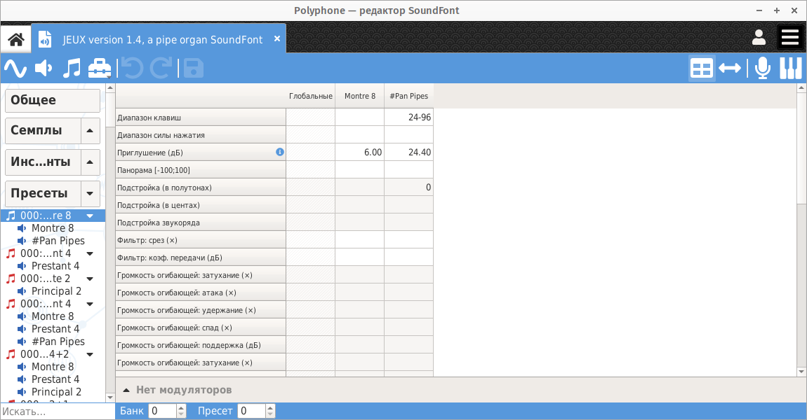

.. _preset editor:

Редактор пресетов
=================

При нажатии на один или несколько пресетов в :ref:`дереве <tree>` открывается страница редактирования пресетов.
Пресет — это комбинация одного или нескольких инструментов и элемент, видимый снаружи :ref:`SoundFont <sf2 format>`.

Как и в :ref:`редакторе инструментов <instrument editor>`, здесь есть несколько частей:

* таблица,
* редактор диапазонов, который открывается при нажатии кнопки :guilabel:`Диапазоны` на :ref:`панели инструментов <toolbar view>`,
* раздел модуляторов.

   Страница пресетов

Если выделен только один пресет, страница позволяет редактировать глобальные параметры пресета и параметры всех его разделов.

Если выделено несколько пресетов, можно отредактировать глобальные параметры каждого из этих пресетов.

Отличия от редактора инструментов
---------------------------------

Параметры, редактируемые здесь, являются относительными в отличие от параметров инструмента, которые, кроме особых случаев, являются абсолютными.
Значения параметров пресета добавляются или умножаются на параметры инструмента, которые его составляют.
Некоторые параметры не могут быть изменены на уровне пресета:

* воспроизведение петли,
* корневая клавиша,
* исключающий класс,
* фиксированная клавиша,
* фиксированная скорость нажатия,
* четыре смещения.

Пресет идентифицируется номером пресета и номером банка, эта комбинация является уникальной и настраивается под таблицей.
Каждый банк содержит 127 пресетов.

Последний банк (128) обычно используется для наборов перкуссии.
