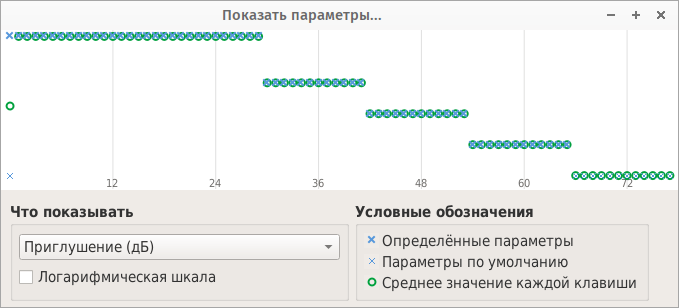
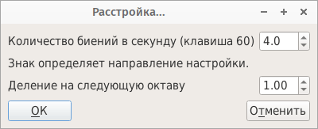
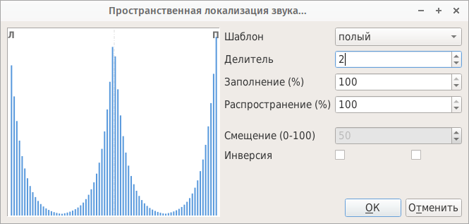

.. _instrument tools:

Обработка инструментов
======================

When an instrument or one of its divisions is selected in the :ref:`tree <tree>`, the :ref:`tool menu <tool menu>` contains several tools sorted in 4 categories:

* :ref:`instrument tools analyze`
* :ref:`instrument tools fast`
* :ref:`instrument tools mod`
* :ref:`instrument tools transformation`

Using the tools simultaneously on several instruments is possible (with a multi selection), except for creating chords, mixtures and for displaying parameters.

.. _instrument tools analyze:

Анализ
------

.. _instrument tool display:

Показать параметры
^^^^^^^^^^^^^^^^^^

This tool displays the evolution of a parameter according to the key.
A logarithmic scale is available (take care of values equal to or less than 0!).

   Display parameter tool

.. _instrument tools fast:

Быстрая правка
--------------

.. _instrument tool attenuation:

Изменить приглушение
^^^^^^^^^^^^^^^^^^^^

The tool computes the minimum and the maximum attenuations in all selected instruments, and gives you the possibility to safely add an offset to all attenuation values.

For example, if the lowest attenuation of the divisions within the selected instruments is 16 dB and if the desired minimal attenuation is 5 dB (to increase the general volume), the attenuation of all divisions of all instruments can be decreased by 11 dB.

.. figure:: images/tool_change_attenuation.png

   Change attenuation tool

.. _instrument tool detune:

Расстройка
^^^^^^^^^^

This feature slightly detunes the instrument notes, so as to create an undulating effect.
The intensity of the effect is adjustable.

   Detuning tool

.. _instrument tool global:

Основанная на клавишах конфигурация
^^^^^^^^^^^^^^^^^^^^^^^^^^^^^^^^^^^

This tool allows the editing of a parameter for all divisions of an instrument simultaneously.

.. figure:: images/tool_keybased_configuration.png

   Key-based configuration tool

The graph represents the modification intensity, the first value on the left corresponding to the change applied to the division comprising the key 0, and the last value on the right corresponding to the change applied to the division comprising the key 127.
By changing the pattern, it is possible to edit the curve:

* manually using the mouse,
* by using a linear law,
* by using an exponential law,
* by using a random generation.

In the case where a linear or exponential law is used, a left click in the graph defines the beginning of the linear or exponential area, a right click defines the end.

The parameter to be modified is chosen in :guilabel:`Parameter`, and the modification type is chosen in :guilabel:`Modification`:

:Addition: the modifier is added to the value of the selected parameter.
:Multiplication: the modifier is multiplied with the value of the selected parameter.
:Replacement: the modifier replaces the value of the selected parameter.

It is possible to apply the changes only on divisions whose velocity range is comprised in a specific range, useful for example in the case where a piano has several velocity layers.

.. _instrument tool release:

Естественное затухание
^^^^^^^^^^^^^^^^^^^^^^

This tool creates automatically a release for each division of the instrument.
Release times are computed taking into account the first two parameters and a pitch modification may be added by using the third one.

.. figure:: images/tool_natural_release.png

   Natural release tool

.. _instrument tool position:

Авто-позиционирование семпла
^^^^^^^^^^^^^^^^^^^^^^^^^^^^

The software automatically determines the key ranges of all divisions of an instrument, in order to optimize their use all over the keyboard.

.. _instrument tool spatialization:

Пространственная локализация звука
^^^^^^^^^^^^^^^^^^^^^^^^^^^^^^^^^^

This feature spatializes sounds according to their pitch, which can be useful for a piano for example (bass and treble left to right).

   Sound spatialization tool

The bars in the graph represent each a string or pipe, having a length in relation to the pitch.
The shortest bar corresponds to the highest note and the longest bar corresponds to the lowest note.

Each note is positioned in the space, the far left corresponding to a sound coming from the left and the extreme right corresponding to a sound coming from the right.
Several patterns can be selected:

:Ascending: trebles are in the left side, basses are in the right side.
:Hollow: basses are at both extremities, trebles are centered.
:Descending: basses are in the left side, trebles are in the right side.
:Spike: trebles are at both extremities, basses are centered.
:Random: trebles and basses are positioned randomly.

Other options are available:

* number of pattern repetitions (divisions number),
* intensity of the effect (spreading),
* filling of a division (filling),
* offset left — right if the spreading is not 100% (offset),
* inversions.

The graph is updated every time a setting changes for a better visualization.
On mouse over, the correspondence note number / balance is displayed.

.. _instrument tool transpose:

Транспонирование
^^^^^^^^^^^^^^^^

The transposition tool allows the transposition of an entire instrument.
The sounds of the instrument are thus the same, but at a different position over the keyboard.

As input, a shift in terms of semitones is required.
For the pitch to be higher, the shift must be positive.
Conversely, for the pitch to be lower the shift must be negative.
The operations performed by the tool, for each division of the instrument, are then as follows:

* the root key is adjusted,
* modification of the fine tuning if the transposition is performed by a number of semitones including decimals,
* shift of the key range according to the number of semitones if :guilabel:`adapt key range` is checked.

.. figure:: images/tool_transpose_inst.png

   Transposition tool

.. _instrument tools mod:

Модуляторы
----------

.. _instrument tool default_mod:

Переопределить модулятор по умолчанию
^^^^^^^^^^^^^^^^^^^^^^^^^^^^^^^^^^^^^

Default modulators are automatically assigned to every instrument.
This tool can create modulators that will override or disable them.

.. figure:: images/tool_default_mod.png

   Overriding tool

.. _instrument tool remove_mod:

Удалить модуляторы
^^^^^^^^^^^^^^^^^^

All modulators of all selected instruments will be removed.

.. note::
   Default modulators will still apply.
   The only way to disable a default modulator is to override it with the tool “:ref:`instrument tool default_mod`”.

.. _instrument tools transformation:

Преобразование
--------------

.. _instrument tool chords:

Создать аккорды
^^^^^^^^^^^^^^^

Based on an instrument, this tool allows you to create all possible chords.
This could be interesting for example for the creation of a choir or pads.

.. figure:: images/tool_create_chords.png

   Tool for creating chords

Here is an example, :download:`before <https://www.polyphone-soundfonts.com/downloads/tutorials/chord_base.mp3>` and :download:`after <https://www.polyphone-soundfonts.com/downloads/tutorials/chord_done.mp3>`.

.. _instrument tool division:

Дублирование раздела
^^^^^^^^^^^^^^^^^^^^

This action has for effect the duplication of all divisions of an instrument.
For example, if a sample linked to an instrument has a key range of 36-38, the software duplicates this division so as to have 3 times this linked sample for the key ranges 36-36, 37-37 and 38-38.
It makes then possible to thoroughly edit each sample parameter for each different note, instead of editing whole divisions with the same parameters.

It is also possible to duplicate the divisions according to velocity ranges.

.. figure:: images/tool_division_duplication.png

   Division duplication tool

.. _instrument tool mixture:

Создание микстуры
^^^^^^^^^^^^^^^^^

Specific to the organ, this tool allows the creation of a mixture from an existing instrument.
An interface appears for specifying the different mixture divisions, and for each the list of the ranks.
Types of possible ranks are very diverse, ranging from the octave to the 27th harmonic.

.. figure:: images/tool_mixture.png

   Mixture creation tool

To work, this tool relies on all samples associated to the selected instrument, the range defined for each sample and the corresponding attenuation.
Samples have to be tuned regardless the definition of the instrument (via the :ref:`sample editor <sample editor>`), and the root key specified must not take into account membership in a stop (no transposition if the sound is a principal 4' for example).

An option allows the automatic loop of created samples, another sets the creation interval of samples.
Finally, it is possible to choose the type of the created sounds: mono or stereo.

Here is an example, :download:`before <https://www.polyphone-soundfonts.com/downloads/tutorials/mixture_base.mp3>` and :download:`after <https://www.polyphone-soundfonts.com/downloads/tutorials/mixture_done.mp3>`.
