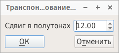

.. _sample tools:

Обработка семплов
=================

Если в :ref:`дереве <tree>` выбран один или несколько семплов, :ref:`меню инструментов <tool menu>` содержит несколько средств, отсортированных по четырём категориям:

* :ref:`sample tools analyze`
* :ref:`sample tools files`
* :ref:`sample tools processing`
* :ref:`sample tools stereo`

Можно использовать средства одновременно с несколькими семплами (при множественном выборе).

.. _sample tools analyze:

Анализ
------

.. _sample tool peakfrequencies:

Показать пиковые частоты
^^^^^^^^^^^^^^^^^^^^^^^^

Это средство собирает информацию о пиковых частотах всех выбранных семплов, и может экспортировать результаты в файл .csv.
Пиковые частоты видны на странице редактирования :ref:`семплов <sample editor frequency>`.

.. figure:: images/tool_show_peak_frequencies.png

   Отображение пиковых частот

.. _sample tools files:

Файлы
-----

.. _sample tool wavexport:

Экспортировать в wav
^^^^^^^^^^^^^^^^^^^^

После того, как вы укажете каталог назначения, все выбранные семплы будут экспортированы в файлы .wav.

.. _sample tools processing:

Обработка семпла
----------------

.. _sample tool autoloop:

Авто-петля
^^^^^^^^^^

Программа ищет стабильную область семпла, а затем искусственно создает петлю.
Звуковой сегмент копируется с перекрёстным затуханием, поэтому переход в месте стыка будет максимально плавным.

Чтобы назначить точки петли автоматически:

#. щёлкните в :ref:`дереве <tree>` по семплу, который нужно зациклить,
#. на странице редактирования :ref:`семплов <sample editor>`:

   * укажите начало и конец петли на графике (в области отображения WAV) в районе стабильной области, или
   * позвольте программе автоматически определить стабильную область, указав 0 в качестве начала и конца петли,

#. в меню :guilabel:`Инструменты` выберите :guilabel:`Семпл`, :guilabel:`Авто-петля`,
#. нажмите кнопку :guilabel:`Воспроизведение` с поставленной галочкой :guilabel:`петля`,
#. если найденные точки петли вас не устраивают, можно :ref:`отменить <toolbar edit>` операцию, попробовать повторно установить их вручную в районе стабильной области, и затем снова использовать функцию :guilabel:`Авто-петля`.

Программа должна найти стабильную область длительностью не менее 0,25 секунд.
Если это не удается, выдаётся предупреждение о том, что петля не найдена.
В этом случае можно вручную указать стабильную область длительностью не менее 0,25 секунд и повторить попытку или попытаться найти точки петли вручную.

.. warning::
   Это средство изменяет исходный семпл.
   Изменения можно отменить с помощью функции «:ref:`отмена <toolbar edit>`», но если сохранить файл и закрыть Polyphone, пути назад уже не будет.

.. note::
   По умолчанию зацикливание в инструменте отключено.
   Чтобы услышать его, нужно выбрать значок |loop on| в строке :guilabel:`Играть петлю` в столбце :guilabel:`Глобальные` или в отдельных столбцах разделов инструмента в :guilabel:`Таблице параметров`.
   |loop on| включает петлю, |loop off| выключает её.
   |loop on + end| включает петлю, а после отпускания клавиши семпл будет проигран до конца.

.. _sample tool volume:

Изменить громкость
^^^^^^^^^^^^^^^^^^

Можно изменить громкость тремя разными способами:

* добавив определённое количество дБ (как положительное так или отрицательное значение),
* умножив сигнал на число,
* нормализовав сигнал таким образом, чтобы его максимум составлял некоторый процент от максимальной интенсивности.

.. figure:: images/tool_change_volume.png

   Изменение громкости

.. _sample tool externalcommand:

Внешняя команда
^^^^^^^^^^^^^^^

Это средство позволяет использовать внешнюю команду или программу для редактирования семпла.
Больше не нужно экспортировать и повторно импортировать семпл в Polyphone, всё делается автоматически:

#. загрузите программу для редактирования wav-файлов, например, :program:`Audacity` или :program:`Sweep` (Linux),
#. выберите средство :guilabel:`Внешняя команда` для одного или нескольких семплов,
#. укажите командную строку в поле ввода для вызова внешней программы (может потребоваться прочитать документацию по этой программе),
#. отредактируйте семплы с помощью внешней программы,
#. сохраните в этой программе изменённую версию wav-файлов и закройте её,
#. семплы автоматически загрузятся в SoundFont.

.. figure:: images/tool_external_command.png

   Запуск внешней команды

.. _sample tool filter:

Фильтровать частоты
^^^^^^^^^^^^^^^^^^^

При использовании этого средства отобразится окно с частотами, содержащимися в выбранных вами семплах.
Мышью можно нарисовать красную область.
Всё, что находится в этой области, будет удалено: это означает, что вы можете вручную приглушить или полностью удалить некоторые частоты.

.. figure:: images/tool_filter_frequencies.png

   Фильтрация частот

.. note::
   Этот фильтр не для широкого использования, так как он жёстко обрезает частоты.
   Это средство может быть полезно, чтобы создать «непробиваемый» фильтр, но в большинстве случаев вы, вероятно, захотите использовать :ref:`эквалайзер <sample editor equalizer>`.

.. _sample tool removeblank:

Убрать тишину в начале
^^^^^^^^^^^^^^^^^^^^^^

Удаляется любая пустая область перед началом семпла.
Это сокращает время до того, как семпл начнёт звучать.

.. figure:: images/remove_blank.png

   Удаление тишины в начале

.. note::
   Это средство может применяться автоматически при каждом импорте семпла, если задать это в :ref:`настройках <general settings>` программы.

.. _sample tool transpose:

Транспонировать
^^^^^^^^^^^^^^^

Запрашивается сдвиг в полутонах, а затем звук повторно сэмплируется для изменения высоты тона.

   Транспонирование

.. _sample tool trimloop:

Обрезать до конца петли
^^^^^^^^^^^^^^^^^^^^^^^

Если для выбранного семпла задана петля, программа обрежет звук после окончания петли (оставив небольшое поле в конце).

.. figure:: images/trim_to_loop.png

   Обрезание петли

.. note::
   Это средство может применяться автоматически при каждом импорте семпла, если задать это в :ref:`настройках <general settings>` программы.

.. _sample tools stereo:

Стерео-семплы
-------------

.. _sample tool balance:

Настройка баланса
^^^^^^^^^^^^^^^^^

Если один семпл связан с другим (стерео), программа может отрегулировать баланс, выровняв среднюю интенсивность двух семплов.
Это упростит точное панорамирование семпла в :ref:`инструменте <instrument editor>`.

.. _sample tool link:

Связать все стерео-семплы
^^^^^^^^^^^^^^^^^^^^^^^^^

Из всех выбранных семплов автоматически связываются те, названия которых отличаются только последней буквой (R/L).
Например, если в SoundFont два семпла называются ``bassoon45L`` и ``bassoon45R``, то ``bassoon45L`` будет распознан как левая часть ``bassoon45R``, а ``bassoon45R`` будет распознан как правая часть ``bassoon45L``.

Учитывая эту информацию, при добавлении этих семплов в инструмент, будет использоваться правильное панорамирование.
Вы также можете одновременно редактировать левую и правую части инструмента в :ref:`таблице <instrument editor table>`, если в :ref:`настройках <general settings>` включена стерео-правка.

.. warning::
   Это средство может поломать существующие ссылки, если имена не соответствуют указанному выше правилу.

.. _sample tool unlink:

Убрать связи со всех стерео-семплов
^^^^^^^^^^^^^^^^^^^^^^^^^^^^^^^^^^^

Со всех выбранных семплов (стерео) убираются связи.

Таким образом, все семплы будут обрабатываться как монофонические звуки, и все они будут иметь одинаковое панорамирование при добавлении в инструмент.
Стерео-правка, если она включена в :ref:`настройках <general settings>`, больше не будет применяться.

.. inline images:

.. |loop on|       image:: images/loop_on.png
.. |loop off|      image:: images/loop_off.png
.. |loop on + end| image:: images/loop_on_end.png
