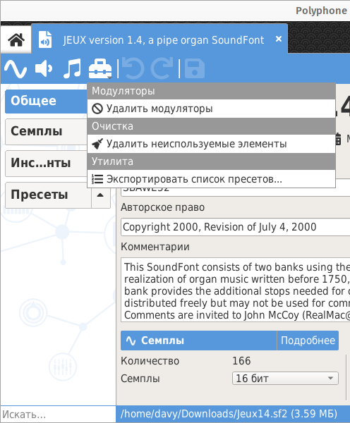
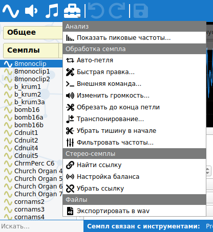
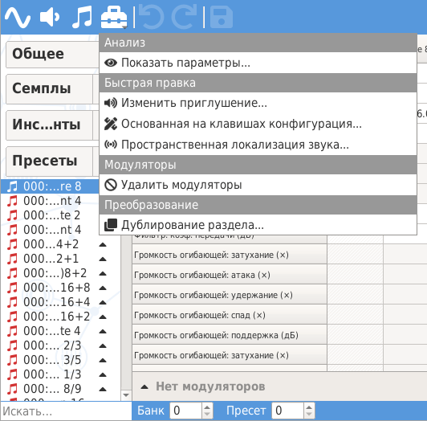

Обзор инструментов
==================

Глобальные инструменты
----------------------

Когда в :ref:`дереве <tree>` выбран заголовок :guilabel:`Общее`, меню инструментов заполняется :ref:`глобальными инструментами <global tools>`.

   Меню инструментов, показывающее глобальные инструменты

Обработка семплов
-----------------

Когда в :ref:`дереве <tree>` выбран один или несколько семплов, меню инструментов заполняется :ref:`инструментами для обработки семплов <sample tools>`.

   Меню инструментов, показывающее инструменты обработки семплов

Обработка инструментов
----------------------

Когда в :ref:`дереве <tree>` выбран один или несколько инструментов (включая разделы), меню инструментов заполняется :ref:`инструментами обработки инструментов <instrument tools>`.

.. figure:: images/tool_menu_instrument.png

   Меню инструментов, показывающее инструменты обработки инструментов

Обработка пресетов
------------------

Когда в :ref:`дереве <tree>` выбран один или несколько пресетов (включая разделы), меню инструментов заполняется :ref:`инструментами обработки пресетов <preset tools>`.

   Меню инструментов, показывающее инструменты обработки пресетов
