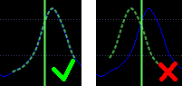

.. _how to prepare a sample:

Как подготовить семпл
=====================

Инструмент внутри SoundFont состоит из семплов, например, из записей реального инструмента.
В этом уроке описывается, как добавить и подготовить семпл в SoundFont.

Импортирование
--------------

Сначала нужно получить семплы.
В интернете можно найти множество бесплатных семплов, записанных либо с реальных инструментов (с флейты, гитары, виолончели и т.д.), либо созданных с использованием различных видов синтеза звука.

Для этого урока подготовлен семпл флейты: :download:`flute.wav <https://www.polyphone-soundfonts.com/downloads/tutorials/flute.wav>`.

Как только он у вас загрузится, создайте новый SoundFont с помощью Polyphone (:menuselection:`меню --> &Создать`) и импортируйте семпл (:guilabel:`Добавить семпл`).

.. figure:: images/import-sample.png

   Импорт семпла

Петля
-----

Введение
^^^^^^^^

Петля — это область в семпле, которая может повторяться для увеличения длительности семпла.
Допустим, семпл длится всего 0,5 секунды, с хорошей петлёй звук может быть продлён до 10 секунд и более.
Это полезно только для семплов не ударных инструментов, таких как флейты, трубы, органы, скрипки.
Наоборот, барабаны не требуют петель.
Это также может иметь смысл для фортепиано или гитары, в зависимости от того, как эти звуки синтезируются.

Таким образом, этот раздел необходим тогда и только тогда, когда вы чувствуете необходимость увеличения исходной длины семпла.
Если нет, перейдите непосредственно к следующему разделу «Настройка».

Настройка петли
^^^^^^^^^^^^^^^

В дереве щёлкните семпл, который хотите зациклить, и сфокусируйтесь на параметрах петли.

.. figure:: images/loop-sample-1.png

   Зацикливание семпла: параметры петли

Если вам повезёт, эти значения были сохранены в файле семпла .wav, и эти поля уже заполнены.
Если нет, или если он был плохо настроен (это может произойти…), произвольно щёлкните слева и справа на графике (области отображения WAV), чтобы определить начало и конец петли.
Это обычно делается на устойчивой фазе звука, а не в пределах атаки или затухания.
Затем смасштабируйте начало цикла и попробуйте наложить зелёную (или красную) кривую с синей.

   Зацикливание семпла: выравнивание волны

Прослушивание результата
^^^^^^^^^^^^^^^^^^^^^^^^

Когда петля настроена, нажмите кнопку :guilabel:`Воспроизведение` на проигрывателе с включённой опцией :guilabel:`петля`, чтобы прослушать результат.

.. figure:: images/loop-sample-3.png

   Зацикливание семпла: прослушивание результата

Если вы не слышите переход после окончания петли, это означает, что петля настроена правильно.
В противном случае оставьте проигрыватель включённым и слегка перемещайте конец и начало петли, пока не найдёте точки, с которыми переход будет настолько плавным, насколько это возможно.
Прослушайте следующие записи, чтобы увидеть разницу между плохим и хорошим зацикливанием:

* :download:`плохое зацикливание <https://www.polyphone-soundfonts.com/downloads/tutorials/bad-loop.mp3>`

  .. raw:: html

     <audio controls="controls">
     <source src="https://www.polyphone-soundfonts.com/downloads/tutorials/bad-loop.mp3" type="audio/mpeg"/>
     Ваш браузер не поддерживает элемент audio.
     </audio>

* :download:`хорошее зацикливание <https://www.polyphone-soundfonts.com/downloads/tutorials/good-loop.mp3>`

  .. raw:: html

     <audio controls="controls">
     <source src="https://www.polyphone-soundfonts.com/downloads/tutorials/good-loop.mp3" type="audio/mpeg"/>
     Ваш браузер не поддерживает элемент audio.
     </audio>

.. note::
   Есть способ, которое позволяет «сжульничать», если вам не удаётся легко найти петлю: средство :ref:`авто-петля <sample tool autoloop>`.
   Он автоматически создаст петлю, вырезав семпл и совместив две части, чтобы конец точно совпадал с началом.
   Просмотрите соответствующую документацию для получения дополнительной информации.

Настройка
---------

Все семплы следует настроить, если вы не хотите получить некачественный инструмент.
Указав точную высоту тона всех импортированных семплов, можно будет адаптировать их к клавишам.
Некоторые семплы могут уже иметь эту информацию, и в этом случае вам не нужно менять значения в полях ввода :guilabel:`Корневая нота` и :guilabel:`Коррекция высоты тона (в центах)`.
Но в качестве меры предосторожности всегда хорошо их проверить.

.. figure:: images/tune-sample-1.png

   Настройка семпла: информация о высоте тона

Включите петлю, если она имеется в семпле, и нажмите кнопку :guilabel:`Воспроизведение` на проигрывателе.
Затем добавьте калибровочный синус и отрегулируйте его громкость, чтобы оба звука были слышны как можно более чётко.

.. figure:: images/tune-sample-2.png

   Настройка семпла: воспроизведение семпла вместе с калибровочным сигналом

Начните настройку с изменения корневой клавиши, пока два звука не будут наиболее близко совпадать.
Продолжите, регулируя коррекцию.
На этом этапе обратите внимание на слышимые биения звука, и сделайте их как можно медленнее.
Вот примеры, содержащие звук флейты и калибровочного синуса:

* :download:`очень плохая настройка <https://www.polyphone-soundfonts.com/downloads/tutorials/very-bad-tune.mp3>` (корневая клавиша не настроена)

  .. raw:: html

     <audio controls="controls">
     <source src="https://www.polyphone-soundfonts.com/downloads/tutorials/very-bad-tune.mp3" type="audio/mpeg"/>
     Ваш браузер не поддерживает элемент audio.
     </audio>

* :download:`плохая настройка <https://www.polyphone-soundfonts.com/downloads/tutorials/bad-tune.mp3>` (коррекция неверна и можно услышать биения)

  .. raw:: html

     <audio controls="controls">
     <source src="https://www.polyphone-soundfonts.com/downloads/tutorials/bad-tune.mp3" type="audio/mpeg"/>
     Ваш браузер не поддерживает элемент audio.
     </audio>

* :download:`хорошая настройка <https://www.polyphone-soundfonts.com/downloads/tutorials/good-tune.mp3>` (оба значения правильны)

  .. raw:: html

     <audio controls="controls">
     <source src="https://www.polyphone-soundfonts.com/downloads/tutorials/good-tune.mp3" type="audio/mpeg"/>
     Ваш браузер не поддерживает элемент audio.
     </audio>

.. note::
   :ref:`Частотный анализ <sample editor frequency>` может быть хорошим индикатором для начала настройки.
   Но имейте в виду, что ни один алгоритм не решит эту задачу настолько хорошо, как ваш слух.

.. figure:: images/tune-sample-3.png

   Настройка семпла: частотный анализ

Другие возможности
------------------

Несколько средств доступны в меню :guilabel:`Инструментарий`.
Вы можете редактировать семплы:

* :ref:`удалить тишину в начале <sample tool removeblank>`,
* :ref:`выровнять звук <sample editor equalizer>`,
* :ref:`транспонировать <sample tool transpose>`,
* :ref:`нормализовать громкость <sample tool volume>`,
* :ref:`отрегулировать баланс <sample tool balance>` стерео-семплов.

Замечание о стерео-семплах
--------------------------

Стерео-семплы созданы из двух моно-семплов.
Ссылка хранится в информации о семпле.

.. figure:: images/stereo-sample.png

   Стерео-семпл

Управление двумя монофоническими семплами может усложнить их зацикливание, потому что петля может хорошо звучать для одной стороны, но не для другой.
В этом случае, не стесняйтесь жульничать, настраивая две разных петли справа и слева.
Качество звука не ухудшится.
